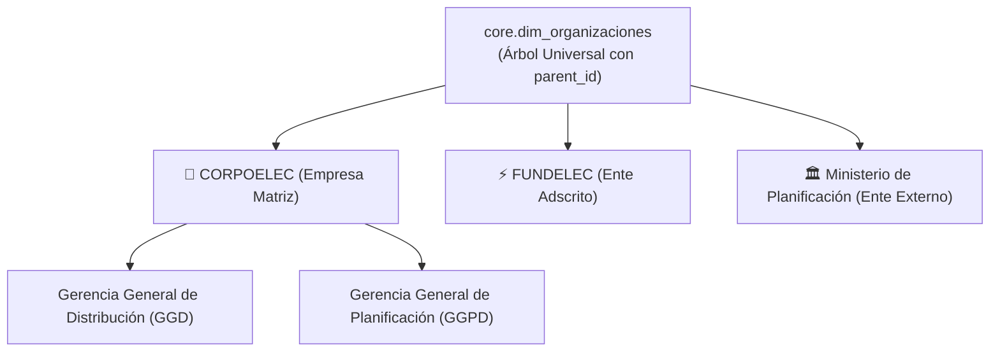

# CORPOELEC — GERENCIA GENERAL DE GESTIÓN DE PLANIFICACIÓN DE DISTRIBUCIÓN (GGPD)

## DICTAMEN TÉCNICO DE FACTIBILIDAD, GOBERNANZA Y HOJA DE RUTA
### EXPANSION MULTI-GERENCIAL, MULTI-ENTE Y MENSAJERÍA ELECTRÓNICA "CERO PAPEL" (SCGCC V2.0)
**Código Normativo:** `GGPD-SCGCC-ESTFAC-2026-V01`  
**Normas y Estándares de Referencia:** ISO/IEC 27001:2022 | ISO 15489-1:2016 | ISO 9001:2015 | ISACA COBIT 2019 | Ley de Mensajes de Datos y Firmas Electrónicas  
**Ciclo Metodológico:** RUP (Rational Unified Process) — Fase de Transición & QA Formal  

---

## 📌 1. ANTECEDENTES Y REQUERIMIENTO ESTRATÉGICO

Durante la presentación de resultados y demostración operativa del sistema **SCGCC V1.0** (*Seguimiento y Control de la Gestión de Correspondencia Corporativa*), directores y gerentes de diversas dependencias (incluyendo la Gerencia General de Distribución - GGD y entes adscritos) manifestaron el interés formal de expandir el uso de la herramienta para:
1. **Adopción Multi-Gerencial y Multi-Ente:** Permitir que la Gerencia General de Distribución (GGD), entes del sector eléctrico (como FUNDELEC) y ministerios afines (como el Ministerio del Poder Popular de Planificación) utilicen la plataforma.
2. **Aislamiento Estricto de Datos:** Garantizar que cada empresa, ente o gerencia visualice única y exclusivamente su universo de correspondencia interna y externa.
3. **Ecosistema de Mensajería Digital "Cero Papel":** Habilitar bandejas de entrada y salida electrónicas inmediatas entre dependencias, eliminando el traslado físico de oficios en papel y automatizando el acuse de recibo.

El presente estudio establece el **criterio técnico, metodológico, financiero y normativo** de la GGPD para responder a esta solicitud sin poner en riesgo la estabilidad del producto actual.

---

## 🛑 2. GOBERNANZA METODOLÓGICA Y PROTECCIÓN DEL PRODUCTO V1.0

### A. Cumplimiento del Ciclo de Vida RUP vs. Riesgo de Prácticas XP en Caliente
El proyecto **SCGCC V1.0** se encuentra actualmente en su **Fase de Transición y QA Formal (Bajo estándar RUP)**.
* **Principio de Calidad:** No se pueden introducir requerimientos de arquitectura no planificados ni iteraciones no controladas (Extreme Programming informal) en un producto a punto de ser entregado.
* **Decisión Estratégica:** La versión **SCGCC V1.0 se lanza tal cual está concebida**, garantizando la estabilidad operativa del despacho de la GGPD y cerrando formalmente este ciclo de entrega.
* **Tratamiento de la Expansión:** Todas las solicitudes de multi-empresa, multi-ente y mensajería electrónica se catalogan formalmente como **Nuevas Reglas de Negocio para el Release SCGCC V2.0**.

### B. Cronograma y Ventana de Adopción Institucional
Para asegurar una evolución sólida y libre de fallas, se establece el siguiente cronograma de transición:

```
[ Semanas 1 - 2 ] ──> Cierre de QA, Despliegue de Producción y Entrega Oficial SCGCC V1.0
[ Meses 1 - 3 ]   ──> Periodo de Operación Piloto en GGPD (Prueba de campo con volumen real)
[ Mes 4 ]         ──> Evaluación de Lecciones Aprendidas, Dimensionamiento con ATIT y Diseño V2.0
```

---

## 🏛️ 3. FACTIBILIDAD TÉCNICA, INFRAESTRUCTURA Y GESTIÓN CON ATIT

### A. Infraestructura Cloud y Almacenamiento (Google Drive vs. Ecosistema ATIT)
* **Situación Actual:** SCGCC V1.0 opera con un Webhook y Google Apps Script vinculado al Google Drive oficial de la **GGPD**.
* **Realidad Corporativa:** No es viable ni seguro almacenar la correspondencia confidencial de toda la empresa o de otros ministerios en el Drive de una sola gerencia.
* **Acción Requerida:** Para la versión V2.0 corporativa, se debe coordinar formalmente con la **Gerencia General de Automatización, Tecnología de la Información y Telecomunicaciones (ATIT)** de CORPOELEC para:
  1. Provisionar la infraestructura en la nube oficial de CORPOELEC (Servidores dedicados, bases de datos PostgreSQL de alta disponibilidad y Object Storage / MinIO corporativo).
  2. Asignar los recursos financieros y de mantenimiento continuo que demanda una plataforma de alcance nacional.

### B. Modelo de Base de Datos Multi-Tenant Recursivo (`core.dim_organizaciones`)
Para evitar la rigidez de esquemas jerárquicos cerrados, la arquitectura de InsForge PostgreSQL para la V2.0 se fundamentará en un árbol adyacente polimórfico:



* **Aislamiento Multi-Tenant (ISO 27001):** Cada registro de correspondencia pertenecerá a una organización emisora y una receptora. Las políticas de Row Level Security (RLS) aseguran que los usuarios solo accedan a lo que compete a su gerencia.

---

## 📬 4. MENSAJERÍA ELECTRÓNICA "CERO PAPEL" Y VALIDEZ JURÍDICA

### A. Mecánica de Bandeja de Entrada / Salida Digital
1. **Emisión Directa:** Cuando la GGD emita un oficio digital hacia la GGPD o FUNDELEC, el documento saldrá de su *Bandeja de Salida* y se depositará instantáneamente en la *Bandeja de Entrada* del receptor.
2. **Acuse de Recibo Automatizado:** En el momento en que el receptor abra el documento, el sistema estampará un sello de tiempo inmutable con registro de usuario e IP, notificando al emisor la recepción formal.

### B. Blindaje Legal y Auditoría (Ley de Mensajes de Datos e ISO 15489)
Para que el sistema "Cero Papel" tenga plena validez probatoria ante la Contraloría General de la República y auditorías institucionales:
1. **Hash Criptográfico SHA-256:** Cada documento PDF oficial generado contendrá una huella digital que garantiza que el texto no ha sido adulterado.
2. **Código QR de Verificación Pública:** Todo oficio contará con un QR al pie de página que permitirá validar su autenticidad y estado de firma desde cualquier dispositivo sin necesidad de tener cuenta en el sistema.

---

## 👥 5. GESTIÓN DEL CAMBIO ORGANIZACIONAL Y MANDATO INSTITUCIONAL

### El Factor Humano y la Brecha de Adopción
Uno de los mayores riesgos en la implementación de software en el sector público es que **la inercia del "cómo se hace ahora" (papel físico, memorándums impresos y mensajeros) prevalezca sobre la aplicación digital**, provocando que las herramientas se conviertan en sistemas fantasmas.

* **Condición de Éxito en la GGPD:** En la Gerencia General de Planificación de Distribución, el sistema **nace con un lineamiento de uso obligatorio y un procedimiento estandarizado**, lo que asegura su adopción al 100%.
* **Requisito para la Expansión a Otras Gerencias:** Para que la GGD, FUNDELEC u otras áreas adopten exitosamente SCGCC V2.0, **se requiere obligatoriamente una Instrucción de Servicio / Oficio Circular emitido por la Presidencia o Dirección Ejecutiva** que establezca el uso de la plataforma como canal oficial vinculante. Sin ese mandato y sin recursos de soporte asignados, la herramienta no podrá sostenerse en el tiempo.

---

## 📊 6. MATRIZ DE DECISIÓN Y HOJA DE RUTA

| Dimensión | Enfoque V1.0 (Lanzamiento Inmediato) | Enfoque V2.0 (Plan de Expansión Corporativa) |
| :--- | :--- | :--- |
| **Alcance Organizacional** | Gerencia General de Planificación (GGPD) | Multi-Gerencial (GGD, GGPD), Entes (FUNDELEC) y Sector Público |
| **Infraestructura** | InsForge BaaS + Google Drive GGPD | Nube Corporativa ATIT + Object Storage Dedicado |
| **Metodología** | Cierre de Fase RUP / QA Aprobado | Plan de Versionado Formal e Iteraciones Planificadas |
| **Marco Administrativo** | Lineamiento Operativo Interno GGPD Activo | Requiere Oficio Circular de Presidencia / Dirección |
| **Tiempos de Ejecución** | Despliegue Inmediato (Puerto 3006) | Desarrollo tras 3 meses de prueba piloto |

---

## 🎯 7. CONCLUSIÓN Y RECOMENDACIÓN EJECUTIVA

1. **Proceder con el Despliegue Oficial de SCGCC V1.0:** Entregar el sistema en su alcance actual para resolver de inmediato la gestión de correspondencia de la GGPD y validar el flujo operativo en condiciones reales.
2. **Registrar formalmente el Requerimiento V2.0:** Documentar el interés de la GGD y entes adscritos como insumo oficial para la planificación del próximo ciclo.
3. **Mesa Técnica con ATIT:** Iniciar los acercamientos institucionales con la Gerencia General de Automatización y Tecnologías de Información para dimensionar la infraestructura en la nube corporativa requerida para soportar a toda la empresa.
4. **Respaldo Institucional:** Condicionar el despliegue multi-gerencial a la emisión formal del lineamiento administrativo de uso obligatorio y a la asignación de recursos operativos.

---
*Elaborado por: Equipo de Automatización e Ingeniería de Productos con IA — Gerencia General de Planificación de Distribución (GGPD)*  
*Fecha: Agosto de 2026*
