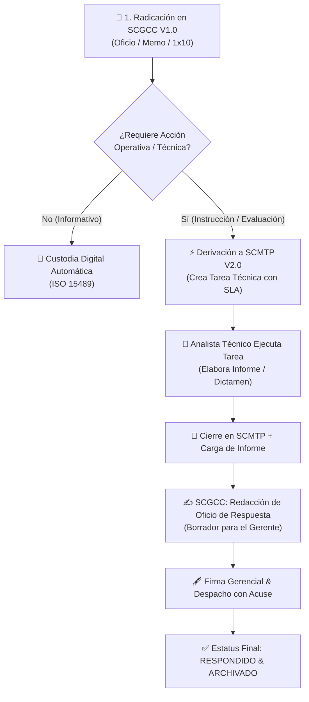

# CORPOELEC — GERENCIA GENERAL DE GESTIÓN DE PLANIFICACIÓN DE DISTRIBUCIÓN (GGPD)

## INFORME DE AVANCE Y DEFINICIÓN FUNCIONAL DE SISTEMA
### SCGCC V1.0 — Seguimiento y Control de la Gestión de Correspondencia Corporativa
**Código Normativo:** `GGPD-SCGCC-DOCFUN-2026-V01`  
**Normas de Referencia:** ISO 15489-1:2016 | ISO 9001:2015 | ISO/IEC 27001:2022 | ISO 8000-110 | ISACA COBIT 2019  

---

| METADATOS INSTITUCIONALES DEL DOCUMENTO |
| :--- |
| **Organización / Ente:** Corporación Eléctrica Nacional, S.A. (CORPOELEC) / MPPEE |
| **Unidad Solicitante / Usuaria:** Gerencia General de Gestión de Planificación de Distribución (GGPD) |
| **Líder de Proyecto:** Yván M. Cipiran N. / Equipo de Automatización e Ingeniería de Productos con IA |
| **Fecha de Emisión de Avance:** 24 de Agosto de 2026 |
| **Estado del Documento:** 🟡 **Informe de Avance y Validación Preliminar con Solicitantes** |
| **Versión del Sistema:** SCGCC V1.0 (Build 2026.08 — Grado Industrial SEN) |
| **Entorno de Prueba / Despliegue:** [https://corpoelec-scgcc-corpoelec-ggpd-hosting-apps.vibehost.space](https://corpoelec-scgcc-corpoelec-ggpd-hosting-apps.vibehost.space) |

---

## 📌 1. PROPÓSITO Y JUSTIFICACIÓN INSTITUCIONAL: ¿POR QUÉ NACE SCGCC?

### 1.1. Diagnóstico de la Problemática Actual
En la operativa diaria de la **Gerencia General de Gestión de Planificación de Distribución (GGPD)**, se recibe y despacha un volumen crítico de correspondencia oficial proveniente del Ministerio del Poder Popular para la Energía Eléctrica (MPPEE), Presidencia de CORPOELEC, Viceministerios, Gerencias Generales Territoriales y Requerimientos del Sistema 1x10 del Buen Gobierno.

Históricamente, la gestión de esta documentación presentaba los siguientes riesgos y cuellos de botella:
1. **Dispersión y Riesgo de Extravío:** Documentos físicos o escaneados almacenados en carpetas locales dispares, correos personales o canales no trazables (WhatsApp), sin una custodia digital unificada.
2. **Incertidumbre en Tiempos de Respuesta (SLA):** Dificultad para auditar en tiempo real qué comunicaciones están próximas a vencer o qué oficios legales requieren respuesta perentoria.
3. **Desconexión entre la Correspondencia y la Acción Operativa:** Una comunicación formal recibida solía quedar como un "trámite administrativo", requiriendo reuniones o llamadas adicionales para que los analistas ejecutaran los estudios técnicos necesarios.
4. **Falta de Trazabilidad 360° para Reuniones Ejecutivas:** Al momento de reuniones de directorio con el Ministro o la Presidencia, recopilar el historial completo de un requerimiento (qué entró, quién lo analizó y qué oficio de respuesta se emitió) tomaba horas o días.

### 1.2. Misión del SCGCC V1.0
El **SCGCC V1.0** se concibe como una plataforma digital de **Grado Industrial SEN** destinada a:
- **Radicar y Centralizar:** Registrar en segundos toda correspondencia de entrada, salida e interna con un correlativo inmutable único.
- **Triaje y Clasificación Inteligente:** Categorizar por criticidad, verbos rectores y nivel de instrucción ejecutiva.
- **Derivar a la Acción (Integración SCMTP):** Convertir automáticamente las instrucciones técnicas en compromisos y tareas asignadas dentro del gestor operativo de la gerencia.
- **Custodiar con Integridad ISO 15489 / ISO 27001:** Almacenar los documentos digitales con firmas criptográficas (Hash SHA-256) en una taxonomía de directorios automatizada.

---

## 🧭 2. ANÁLISIS DE CONSULTAS CLAVE Y DECISIONES DE DISEÑO FUNCIONAL

Durante la fase de análisis y diseño preliminar se abordaron interrogantes estratégicas fundamentales para garantizar que el sistema responda a la realidad del sector eléctrico:

### 2.1. ¿Cómo se tratan las Instrucciones Directas del Gerente General y del Ministro?
Se analizó la necesidad de establecer un canal preferencial de alta jerarquía. No toda correspondencia es un simple memorándum informativo; existen **Instrucciones Ejecutivas Vinculantes**.

El sistema clasifica la correspondencia según **Verbos Rectores y Niveles de Jerarquía**:

| Nivel de Prioridad | Verbo Rector / Naturaleza | Tipo de Emisor | Tratamiento en SCGCC | Plazo Estándar (SLA) |
| :--- | :--- | :--- | :--- | :---: |
| **🚨 URGENTE / ORDEN EJECUTIVA** | **INSTRUCCIÓN DIRECTA** *(Ejecutar, Acatar, Desplegar)* | Ministro / Despacho Presidencia / Gerente General | **Canal Preferencial Rojo:** Notificación inmediata, derivación automática a tarea de máxima prioridad en SCMTP. | **24 a 48 Horas** |
| **⚡ ALTA / TÉCNICA** | **EVALUACIÓN / DICTAMEN** *(Evaluar, Analizar, Informar)* | Viceministerios / Gerencias Generales de Distribución | **Canal Ámbar:** Asignación a especialista técnico para elaboración de informe técnico. | **3 a 5 Días Hábiles** |
| **📋 MEDIA / REVISIÓN** | **REVISIÓN / CONFORMIDAD** *(Revisar, Validar, Cotejar)* | Gerencias Estadales / Supervisiones | **Canal Azul:** Revisión de antecedentes y emisión de visto bueno formal. | **5 a 10 Días Hábiles** |
| **ℹ️ ORDINARIA / INFORMATIVA** | **CONOCIMIENTO / DIFUSIÓN** *(Notificar, Archivar)* | Entes Externos / Circulares Institucionales | **Canal Esmeralda:** Radicación, acuse y custodia directa en archivo digital sin derivar tarea. | N/A (Informativo) |

---

### 2.2. ¿Dónde viajan los documentos cargados? (Estructura de Directorios vs. Tradición)
Una de las consultas principales de los solicitantes fue el destino físico de los archivos escaneados: *¿Quedan sueltos en el sistema o viajan a las carpetas organizadas de la gerencia?*

#### Política de Custodia Digital Estandarizada (ISO 15489):
El sistema implementa un **Enfoque Híbrido Automatizado**. La secretaria o analista **no necesita crear carpetas manuales ni renombrar archivos**. Al adjuntar el documento en el SCGCC:
1. El sistema genera una **Nomenclatura Canónica Normalizada**:  
   `[CORRELATIVO]_[NRO_ORIGEN]_[FECHA_RECEPCION].pdf`  
   *(Ejemplo: `RAD-GGPD-2026-0012_OF-MPPEE-045_2026-08-24.pdf`)*.
2. El archivo se envía automáticamente a la estructura jerárquica corporativa en almacenamiento seguro / Google Drive Institucional:

```text
📁 CORPOELEC_GGPD_CORRESPONDENCIA/
 └── 📁 2026/
      ├── 📁 01_ENTRADAS/
      │    ├── 📁 OFICIOS_MINISTERIO_MPPEE/
      │    ├── 📁 OFICIOS_PRESIDENCIA_CORPOELEC/
      │    ├── 📁 SOLICITUDES_1X10_BUEN_GOBIERNO/
      │    └── 📁 MEMORANDUMS_GERENCIAS_GENERALES/
      ├── 📁 02_SALIDAS_DESPACHOS/
      │    ├── 📁 BORRADORES_EN_REVISION/
      │    ├── 📁 PENDIENTES_FIRMA_GERENCIAL/
      │    └── 📁 OFICIOS_DESPACHADOS_CON_ACUSE/
      ├── 📁 03_INTERNAS/
      └── 📁 04_CONFIDENCIAL_RESERVADO/ 🔒 (Acceso Restringido ISO 27001)
```

3. **Doble Vía de Consulta:**
   - **Vía Rápida Web:** Desde el buscador de SCGCC, cualquier usuario autorizado abre el documento en 1 clic.
   - **Vía Carpeta Institucional:** Quien consulte Google Drive o la red corporativa encontrará todos los documentos ordenados por año y categoría, sin duplicados ni nombres corruptos.

---

### 2.3. Segregación de Seguridad y Confidencialidad (ISO/IEC 27001)
- **Documentos Ordinarios:** Visibles para el equipo técnico asignado a la gerencia.
- **Documentos Confidenciales / Reservados:** Visibles **exclusivamente** para el Gerente General y la Secretaría de Despacho. Al derivar una tarea técnica a un analista, este recibe la *instrucción operativa* sin exponer el documento digital reservado, salvo autorización expresa.

---

## 🔗 3. INTEGRACIÓN OPERATIVA SCGCC $\leftrightarrow$ SCMTP (CIERRE DEL CICLO)

El siguiente diagrama detalla cómo la correspondencia recibida en SCGCC se transforma en resultados técnicos y retorna como oficio despachado:



---

## 📊 4. ESTADO DE AVANCE: LO SOLICITADO VS. LO ENTREGADO

| Módulo / Requerimiento | Alcance Solicitado | Estado Actual Entregado | Próximo Paso (Continuación) |
| :--- | :--- | :---: | :--- |
| **Autenticación & Seguridad** | Acceso seguro corporativo con estándares de la empresa. | 🟢 **100% Entregado** (Login unificado Grado Industrial SEN, ISO 27001, sin precarga de credenciales). | Asignación de roles granulares en base de datos. |
| **Módulo de Radicación** | Registro de correspondencia entrante y saliente. | 🟢 **Estructura Diseñada** (Tabla PostgreSQL `scgcc.mae_correspondencias` lista en InsForge BaaS). | Mapeo interactivo de formularios de radicación rápida. |
| **Clasificación por Verbos / Prioridad** | Priorización de instrucciones del Ministro y Gerente. | 🟢 **Modelo Definido** (Matriz de 4 niveles de prioridad y verbos de acción). | Filtros visuales por semáforo de vencimiento en el Dashboard. |
| **Custodia de Archivos PDF** | Destino de archivos y ordenamiento documental. | 🟢 **Arquitectura Aprobada** (Esquema taxonómico ISO 15489 y soporte Google Drive/Storage). | Conexión con el bucket de carga de archivos. |
| **Derivación de Tareas** | Enlazar correspondencia con SCMTP. | 🟢 **Modelo Relacional Listo** (Campos `tarea_scmtp_id` y tablas cruzadas preparadas). | Webhook de disparo automático de tareas hacia SCMTP. |

---

## 🚀 5. ENLACE DE ACCESO AL PROTOTIPO EN VIVO

Para revisión y pruebas preliminares de la interfaz y el estándar de seguridad:
- **URL Oficial de Despliegue:** [https://corpoelec-scgcc-corpoelec-ggpd-hosting-apps.vibehost.space](https://corpoelec-scgcc-corpoelec-ggpd-hosting-apps.vibehost.space)
- **Identidad de Proceso:** `PROCESO GGPD-SEC-01 • GESTIÓN DE CORRESPONDENCIA & DESPACHO`
- **Paleta Institucional:** Púrpura Protocolar / Amatista SEN

---

*Documento elaborado por el Equipo de Automatización e Ingeniería de Productos con IA para la Gerencia General de Gestión de Planificación de Distribución (GGPD) — CORPOELEC.*
