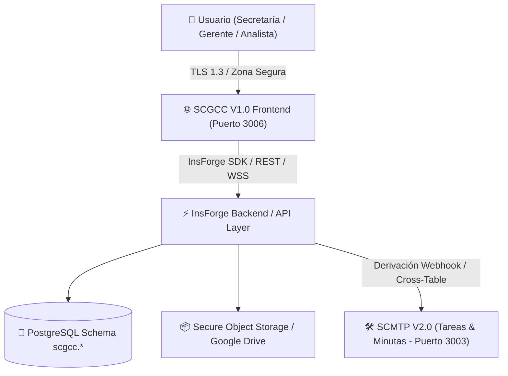

# CORPOELEC — GERENCIA GENERAL DE GESTIÓN DE PLANIFICACIÓN DE DISTRIBUCIÓN (GGPD)

## DOCUMENTO TÉCNICO DE ARQUITECTURA, DATOS Y GOBERNANZA
### SCGCC V1.0 — Seguimiento y Control de la Gestión de Correspondencia Corporativa
**Código Normativo:** `GGPD-SCGCC-DOCTEC-2026-V01`  
**Normas de Referencia:** ISO/IEC 27001:2022 | ISO 15489-1:2016 | ISO 8000-110 | OWASP ASVS v4.0 Level 2 | ISACA COBIT 2019  

---

## 🏛️ 1. ARQUITECTURA GENERAL DEL SISTEMA

El sistema **SCGCC V1.0** opera como una Single Page Application (SPA) moderna desarrollada con **React 19 + TypeScript + Vite + Tailwind CSS**, conectada a la base de datos PostgreSQL en **InsForge BaaS** (`ggpd-data-maestra-0002`) y desplegada en **VibeHost**.



---

## 🗄️ 2. ESQUEMA DE BASE DE DATOS POSTGRESQL (`scgcc.*`)

El esquema `scgcc` en PostgreSQL garantiza el aislamiento de datos y el cumplimiento de **ISO 8000-110 (Calidad de Datos)** e **ISO 27001 (Control de Acceso)**:

### 2.1. Tabla Maestra de Correspondencia (`scgcc.mae_correspondencias`)
```sql
CREATE TABLE IF NOT EXISTS scgcc.mae_correspondencias (
    id UUID PRIMARY KEY DEFAULT gen_random_uuid(),
    correlativo VARCHAR(30) UNIQUE NOT NULL, -- RAD-GGPD-2026-0001
    direccion VARCHAR(20) NOT NULL CHECK (direccion IN ('ENTRADA', 'SALIDA', 'INTERNA')),
    tipo_documento VARCHAR(30) NOT NULL CHECK (tipo_documento IN ('OFICIO', 'MEMORANDUM', 'PUNTO_DE_CUENTA', 'CIRCULAR', 'SOLICITUD_1X10', 'INFORME_TECNICO', 'OTRO')),
    numero_documento_origen VARCHAR(100) NOT NULL,
    remitente_institucion VARCHAR(200) NOT NULL,
    remitente_nombre VARCHAR(150),
    remitente_cargo VARCHAR(150),
    destinatario_principal VARCHAR(200) NOT NULL,
    destinatarios_copia TEXT,
    asunto TEXT NOT NULL,
    descripcion_sintesis TEXT,
    nivel_confidencialidad VARCHAR(30) NOT NULL DEFAULT 'ORDINARIO' CHECK (nivel_confidencialidad IN ('ORDINARIO', 'CONFIDENCIAL', 'RESERVADO_DIRECTIVA')),
    prioridad VARCHAR(20) NOT NULL DEFAULT 'MEDIA' CHECK (prioridad IN ('BAJA', 'MEDIA', 'ALTA', 'URGENTE_24H')),
    
    fecha_emision_origen DATE NOT NULL,
    fecha_recepcion DATE NOT NULL DEFAULT CURRENT_DATE,
    fecha_limite_respuesta DATE, -- Control de SLA
    
    estado_tramite VARCHAR(30) NOT NULL DEFAULT 'RADICADO' CHECK (estado_tramite IN ('RADICADO', 'EN_REVISION', 'ASIGNADO_CON_TAREA', 'BORRADOR_RESPUESTA', 'PENDIENTE_FIRMA', 'FIRMADO_FISICO', 'DESPACHADO_CON_ACUSE', 'RESPONDIDO', 'ARCHIVADO', 'ANULADO')),
    
    medio_entrega VARCHAR(50),
    observaciones TEXT,
    requiere_respuesta BOOLEAN DEFAULT FALSE,
    oficio_respuesta_ref VARCHAR(50),
    
    tarea_scmtp_id VARCHAR(50),
    tarea_scmtp_titulo TEXT,
    responsable_asignado_id UUID REFERENCES core.mae_usuarios_sistema(id),
    responsable_cargo VARCHAR(150),
    
    pdf_drive_url TEXT,
    pdf_drive_id VARCHAR(100),
    pdf_file_name VARCHAR(255),
    
    metadata_json JSONB DEFAULT '{}'::jsonb,
    created_at TIMESTAMP WITH TIME ZONE DEFAULT NOW(),
    updated_at TIMESTAMP WITH TIME ZONE DEFAULT NOW()
);
```

### 2.2. Tabla de Oficios de Salida y Control de Firmas (`scgcc.mae_oficios_salida`)
```sql
CREATE TABLE IF NOT EXISTS scgcc.mae_oficios_salida (
    id UUID PRIMARY KEY DEFAULT gen_random_uuid(),
    correspondencia_origen_id UUID NOT NULL REFERENCES scgcc.mae_correspondencias(id) ON DELETE CASCADE,
    correlativo_origen VARCHAR(30) NOT NULL,
    numero_oficio VARCHAR(50) UNIQUE NOT NULL, -- GGPD-OF-2026-0045
    tipo_documento VARCHAR(30) NOT NULL DEFAULT 'OFICIO',
    destinatario_institucion VARCHAR(200) NOT NULL,
    destinatario_nombre VARCHAR(150) NOT NULL,
    destinatario_cargo VARCHAR(150) NOT NULL,
    asunto TEXT NOT NULL,
    referencia_antecedente VARCHAR(150),
    cuerpo_texto TEXT NOT NULL,
    conclusiones_tecnicas TEXT,
    firmante_nombre VARCHAR(150) NOT NULL DEFAULT 'Ing. Adrián Correa',
    firmante_cargo VARCHAR(150) NOT NULL DEFAULT 'Gerente General de Planificación de Distribución',
    redactado_por_id UUID REFERENCES core.mae_usuarios_sistema(id),
    estado_firma VARCHAR(30) NOT NULL DEFAULT 'PENDIENTE_FIRMA' CHECK (estado_firma IN ('BORRADOR_REVISION', 'PENDIENTE_FIRMA', 'EN_CORRECCION', 'FIRMADO_FISICO', 'DESPACHADO_CON_ACUSE')),
    observaciones_revision TEXT,
    fecha_creacion DATE NOT NULL DEFAULT CURRENT_DATE,
    fecha_firma DATE,
    fecha_despacho DATE,
    nro_guia_acuse VARCHAR(100),
    receptor_acuse_nombre VARCHAR(150),
    copias TEXT,
    anexos TEXT,
    created_at TIMESTAMP WITH TIME ZONE DEFAULT NOW(),
    updated_at TIMESTAMP WITH TIME ZONE DEFAULT NOW()
);
```

---

## 🛡️ 3. SEGURIDAD Y CONTROL DE AUDITORÍA (COBIT MEA02 & ISO 27001)

1. **Row Level Security (RLS):** Cada fila en `scgcc.mae_correspondencias` aplica políticas PostgreSQL para restringir el acceso a documentos clasificados como `CONFIDENCIAL` o `RESERVADO_DIRECTIVA`.
2. **Hash Criptográfico de Archivos (SHA-256):** Cada archivo adjunto registrado en `scgcc.mae_adjuntos` calcula su firma digital para garantizar que ningún documento sea alterado tras su radicación.
3. **Traza Inmutable:** La tabla `scgcc.mae_trazabilidad` registra usuario, fecha, hora, IP y cambio de estado ante cualquier acción realizada.
