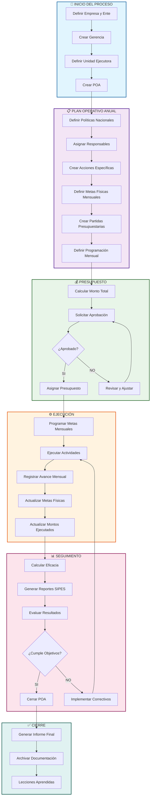
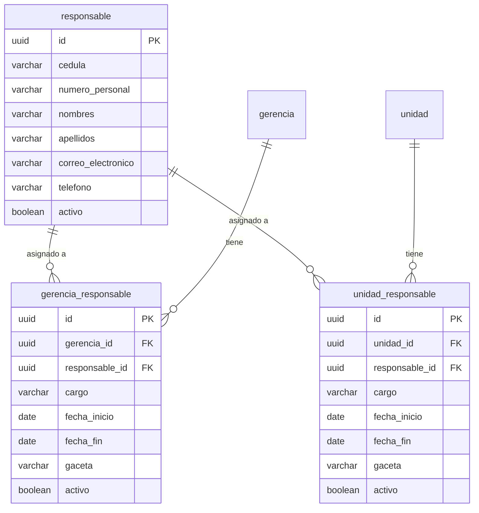
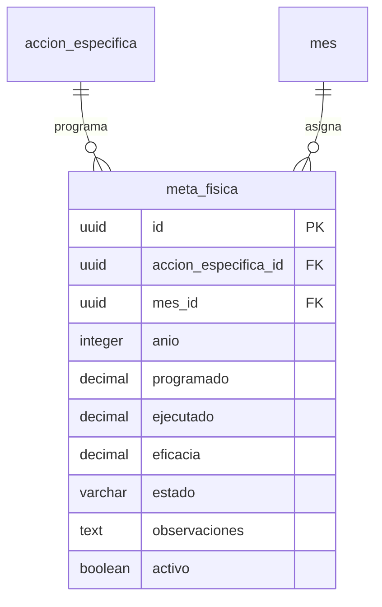
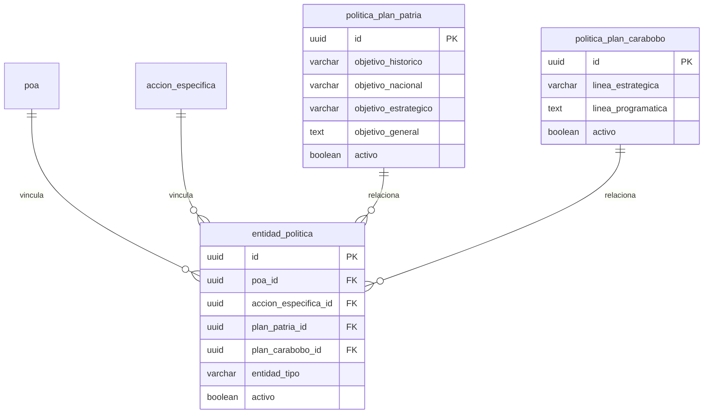
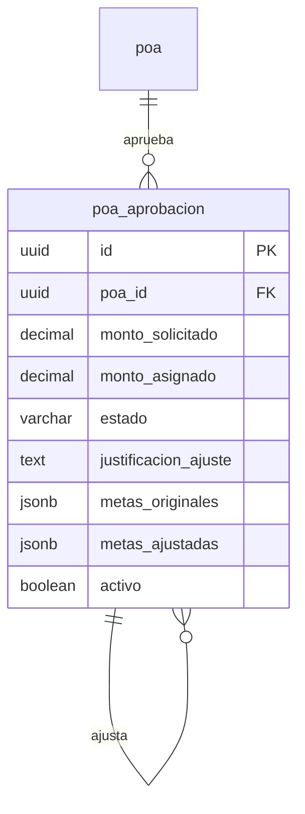
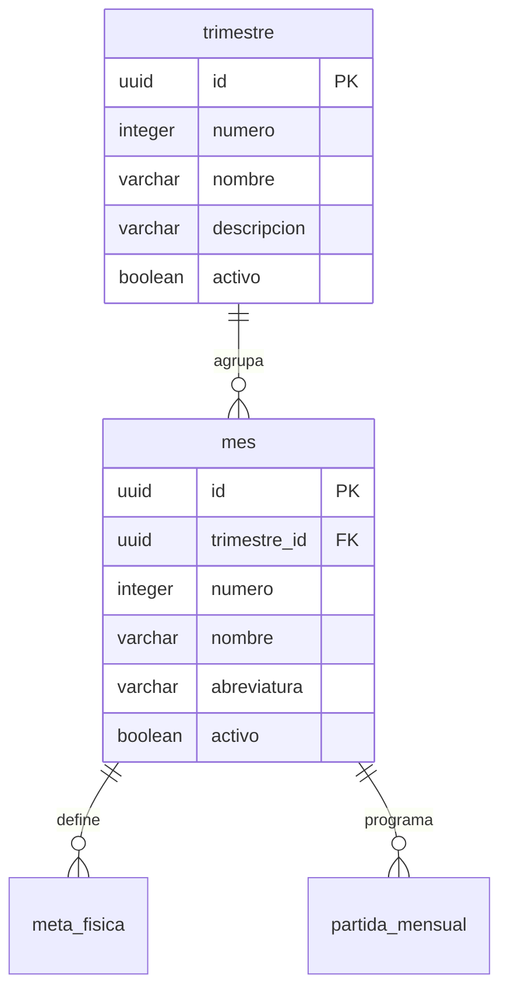
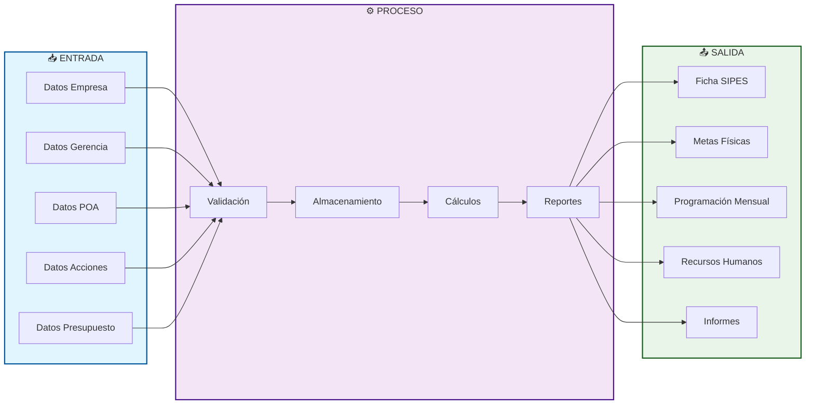

# Diagramas del Sistema de Planificación Eléctrica

## 1. DIAGRAMA DE FLUJO DE TRABAJO



---

## 2. DIAGMA DE ENTIDADES DE LA BASE DE DATOS

### 2.1 Estructura Jerárquica Principal

```mermaid
erDiagram
    empresa ||--o{ ente : "tiene"
    ente ||--o{ gerencia : "administra"
    gerencia ||--o{ unidad : "contiene"
    unidad ||--o{ poa : "ejecuta"
    poa ||--o{ accion_especifica : "define"
    accion_especifica ||--o{ partida_presupuestaria : "presupuesta"
    partida_presupuestaria ||--o{ recurso_humano : "detaila"
    partida_presupuestaria ||--o{ partida_mensual : "programa"

    empresa {
        uuid id PK
        varchar nombre
        varchar siglas
        varchar tipo
        varchar ambito
        boolean activo
    }

    ente {
        uuid id PK
        uuid empresa_id FK
        varchar nombre
        varchar siglas
        varchar tipo
        boolean activo
    }

    gerencia {
        uuid id PK
        uuid ente_id FK
        varchar nombre
        varchar ambito
        varchar proceso_medular
        varchar ceco
        varchar codigo_sap
        uuid region_id FK
        uuid estado_id FK
        uuid municipio_id FK
        text direccion_fisica
        varchar centro_servicios
        boolean activo
    }

    unidad {
        uuid id PK
        uuid gerencia_id FK
        varchar nombre
        varchar siglas
        boolean activo
    }

    poa {
        uuid id PK
        uuid unidad_id FK
        varchar nombre
        text descripcion
        date fecha_inicio
        date fecha_fin
        varchar estado
        varchar codigo_sipes
        boolean es_plurianual
        varchar situacion_presupuestaria
        varchar responsable_ejecucion_nombre
        varchar responsable_tecnico_nombre
        varchar responsable_admin_nombre
        text localizacion
        boolean activo
    }

    accion_especifica {
        uuid id PK
        uuid poa_id FK
        varchar codigo
        varchar nombre
        text descripcion
        varchar unidad_medida
        integer orden
        decimal ponderacion
        date fecha_inicio_accion
        date fecha_fin_accion
        varchar ejecutor
        text meta
        boolean activo
    }

    partida_presupuestaria {
        uuid id PK
        uuid accion_especifica_id FK
        varchar codigo
        varchar nombre
        text descripcion
        decimal monto_presupuestado
        decimal monto_ejecutado
        decimal cantidad
        varchar unidad_medida
        decimal costo_unitario
        text justificacion
        boolean activo
    }

    recurso_humano {
        uuid id PK
        uuid partida_presupuestaria_id FK
        varchar rol_funcional
        integer dedicacion_meses
        decimal costo_mensual
        decimal costo_anual
        boolean activo
    }

    partida_mensual {
        uuid id PK
        uuid partida_presupuestaria_id FK
        uuid mes_id FK
        decimal monto_solicitado
        decimal monto_asignado
        decimal monto_ejecutado
        boolean activo
    }
```



### 2.2 Sistema de Geolocalización

```mermaid
erDiagram
    region_geografica ||--o{ estado : "contiene"
    estado ||--o{ municipio : "divide"
    estado ||--o{ gerencia : "ubica"

    region_geografica {
        uuid id PK
        varchar codigo
        varchar nombre
        boolean activo
    }

    estado {
        uuid id PK
        uuid region_geografica_id FK
        varchar codigo_ine
        varchar nombre
        boolean activo
    }

    municipio {
        uuid id PK
        uuid estado_id FK
        varchar nombre
        boolean activo
    }
```



### 2.3 Sistema de Responsables



### 2.4 Sistema de Metas Físicas



### 2.5 Sistema de Políticas Nacionales



### 2.6 Sistema de Aprobación y Seguimiento



### 2.7 Referencias Temporales



---

## 3. DIAGRAMA COMPLETO DE LA BASE DE DATOS

```mermaid
flowchart TB
    subgraph GEO["🌍 GEOLOCALIZACIÓN"]
        RG[region_geografica] --> EST[estado]
        EST --> MUN[municipio]
    end

    subgraph ESTRUCTURA["🏢 ESTRUCTURA ORGANIZATIVA"]
        EMP[empresa] --> ENT[ente]
        ENT --> GER[gerencia]
        GER --> UNI[unidad]
        GER --> GEO
    end

    subgraph RESPONSABLES["👤 RESPONSABLES"]
        RES[responsable]
        RES --> GR[gerencia_responsable]
        RES --> UR[unidad_responsable]
        GR --> GER
        UR --> UNI
    end

    subgraph POA["📋 PLAN OPERATIVO ANUAL"]
        UNI --> POA[poa]
        POA --> AE[accion_especifica]
        AE --> PP[partida_presupuestaria]
        PP --> RH[recurso_humano]
        PP --> PM[partida_mensual]
        POA --> PA[poa_aprobacion]
    end

    subgraph METAS["🎯 METAS FÍSICAS"]
        AE --> MF[meta_fisica]
        MF --> MES[mes]
        MES --> TRI[trimestre]
    end

    subgraph POLITICAS["🏛️ POLÍTICAS NACIONALES"]
        PPP[politica_plan_patria]
        PPC[politica_plan_carabobo]
        POA --> EP[entidad_politica]
        AE --> EP
        EP --> PPP
        EP --> PPC
    end

    subgraph VISTAS["📊 VISTAS SIPES"]
        VF[v_ficha_sipes]
        VDA[v_detalle_acciones_sipes]
        VDP[v_detalle_partidas_sipes]
        VRH[v_resumen_recurso_humano]
    end

    subgraph AUDITORIA["🔒 AUDITORÍA"]
        AUD[auditoria]
    end

    style GEO fill:#e1f5fe,stroke:#01579b,stroke-width:2px
    style ESTRUCTURA fill:#f3e5f5,stroke:#4a148c,stroke-width:2px
    style RESPONSABLES fill:#e8f5e8,stroke:#1b5e20,stroke-width:2px
    style POA fill:#fff3e0,stroke:#e65100,stroke-width:2px
    style METAS fill:#fce4ec,stroke:#880e4f,stroke-width:2px
    style POLITICAS fill:#e0f2f1,stroke:#004d40,stroke-width:2px
    style VISTAS fill:#f5f5f5,stroke:#616161,stroke-width:2px
    style AUDITORIA fill:#fff8e1,stroke:#f57f17,stroke-width:2px
```

---

## 4. FLUJO DE DATOS DEL SISTEMA



---

## 5. RESUMEN DE ENTIDADES

| Categoría | Tablas | Descripción |
|-----------|--------|-------------|
| **Geolocalización** | 3 | region_geografica, estado, municipio |
| **Estructura Organizativa** | 4 | empresa, ente, gerencia, unidad |
| **Responsables** | 3 | responsable, gerencia_responsable, unidad_responsable |
| **Plan Operativo Anual** | 5 | poa, accion_especifica, partida_presupuestaria, recurso_humano, partida_mensual |
| **Metas Físicas** | 3 | meta_fisica, mes, trimestre |
| **Políticas Nacionales** | 3 | politica_plan_patria, politica_plan_carabobo, entidad_politica |
| **Aprobación** | 1 | poa_aprobacion |
| **Auditoría** | 1 | auditoria |
| **TOTAL** | **23 tablas** | + 9 vistas SIPES |
