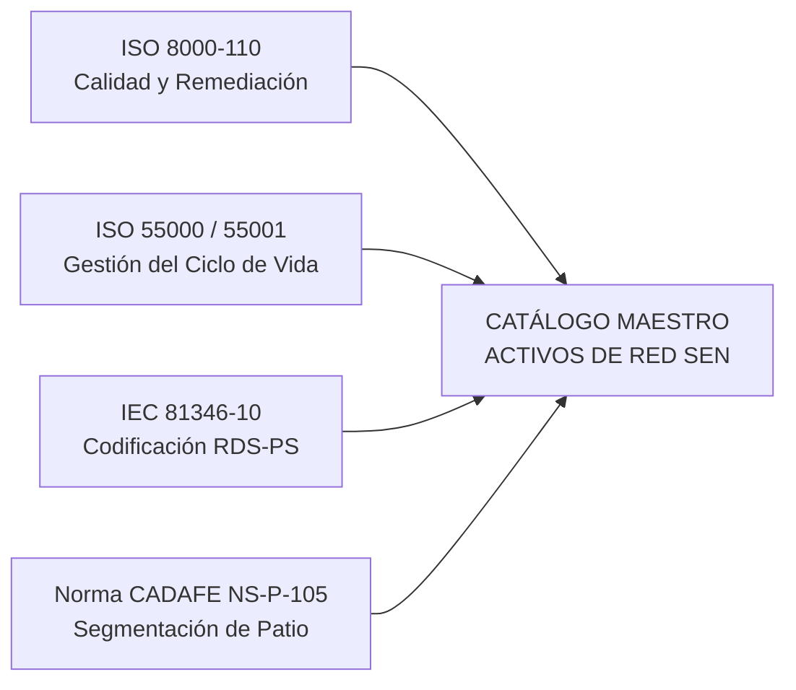

# INFORME TÉCNICO DE AUDITORÍA, NORMALIZACIÓN Y GOBERNANZA DE ACTIVOS DE RED (SE Y CT)

```
========================================================================================
REPÚBLICA BOLIVARIANA DE VENEZUELA — MINISTERIO DEL PODER POPULAR PARA LA ENERGÍA ELÉCTRICA
CORPORACIÓN ELÉCTRICA NACIONAL (CORPOELEC) — GERENCIA GENERAL DE DISTRIBUCIÓN (GGPD)
EQUIPO DE AUTOMATIZACIÓN E INGENIERÍA DE PRODUCTOS CON IA, DE PLANIFICACIÓN DE DISTRIBUCIÓN
========================================================================================
CÓDIGO NORMATIVO: GGPD-SGM-AUD-002 v1.0 ISO
DOCUMENTO ID:     NAC_2026_GGPD_AUDITORIA_CARACTERIZACION_ACTIVOS_RED_V01
FECHA DE EMISIÓN: AGOSTO 2026
ESTÁNDARES:       ISO 8000-110 | ISO 55000 / 55001 | IEC 81346-10 | NORMA CADAFE NS-P-105
RESPONSABLES:     Yván M. Cipiran N. | T.S.U. Josué Pacheco
========================================================================================
```

---

## 1. RESUMEN EJECUTIVO

El presente informe formaliza el diagnóstico, auditoría técnica y actualización del **Inventario Maestro de Activos de Red de Distribución (Subestaciones y Circuitos)** a nivel nacional, derivado del proceso de ingeniería de datos y normalización semántica asistido por **Google Gemini SPARK** y la incorporación de la norma venezolana **NS-P-105 (CADAFE / EDELCA / CORPOELEC)** para nomenclatura de componentes y equipos de maniobra en subestaciones.

La actualización consolida un **grafo topológico relacional 1:N** entre Circuitos de Distribución ($CT$) y sus Subestaciones de Cabecera ($SE$), integrando **871 Subestaciones** y **4,207 Activos de Distribución** con un modelo de **doble capa**:
1. **Capa Macro (Control Operativo & Balances):** 100% de los registros se gestionan formalmente como `CIRCUITO` (`tipo_activo = 'CT'`) para no alterar los cálculos de ENS (MWh), indisponibilidad y balances institucionales.
2. **Capa Especialista (Segmentación Técnica NS-P-105):** Atributos complementarios para clasificar componentes de patio (Seccionadores $S$, Disyuntores $D$, Barras $B$, Líneas $L$, Transformadores $T$, etc.) reportados como circuitos.

### 📊 Métricas Clave Consolidadas

| Métrica / Parámetro | Valor Previo (Legacy) | Valor Normalizado SPARK 2026 | Variación / Impacto |
| :--- | :---: | :---: | :--- |
| **Subestaciones Totales (SE)** | 871 | **871** | 100% categorizadas (451 Transmisión / 420 Distribución) |
| **Subestaciones Móviles (`ES_MOVIL`)** | Indeterminado | **2 Oficiales Identificadas** | Banda Ciudadana y San Mateo |
| **Circuitos Totales (CT)** | 4,207 | **4,207** | 100% con enlace relacional `se_codigo` |
| **Alimentadores Convencionales** | No tipificado | **4,022** | Circuitos estándar de distribución abierta |
| **Seccionadores de Maniobra ($S$)** | Incrustado en nombre | **140** | Segregados con código de maniobra `S1..S10` |
| **Posiciones / Bahías de Reserva ($Q$)** | Incrustado en nombre | **25** | Identificadas como reserva de ampliación |
| **Juegos de Barras ($B$)** | No tipificado | **10** | Barras colectoras y de transferencia |
| **Líneas de Interconexión MT ($L$)** | No tipificado | **9** | Enlaces troncales en 34.5 kV |
| **Transformadores de Distribución ($T$)** | No tipificado | **1** | Unidad dedicada de transformación |
| **Integridad Referencial ($CT \to SE$)** | Discrepancias en Falcón | **100.0% (0 Huérfanos)** | Normalización confirmada `YARACAL II` |
| **Entidades Territoriales Mapeadas** | 24 | **25 (Inc. Guayana Esequiba 🇻🇪)** | Cobertura federal completa |

---

## 2. PILARES DE AUDITORÍA Y CUMPLIMIENTO NORMATIVO



### A. Calidad de Datos ISO 8000-110 & Remediaciones Aplicadas
1. **Remediación de Cabecera Yaracal II en Falcón:**  
   Se subsanó el error tipográfico/OCR (`YARACAL LL` $\to$ `YARACAL II`), vinculando los circuitos `CT-FAL-01467..01469` (`MIRIMIRE`, `PEQUIVEN`, `YARACAL`) formalmente a la Subestación `SE-FAL-0320` (`YARACAL I / II`), alcanzando **100% de Integridad Referencial**.
2. **Saneamiento de Cabeceras en Blanco:**  
   Se completaron 11 registros con clave foránea `se_codigo` válida pero sin texto descriptivo de cabecera (6 líneas en Carabobo $\to$ `CENTRO / QUIZANDA` y 5 posiciones de reserva en Zulia $\to$ `NODO ZULIA`).

### B. Segmentación Técnica Especializada según Norma CADAFE/EDELCA NS-P-105
Conforme a la norma técnica venezolana `NS-P-105`:
* **Seccionadores ($S$ / $M$ - 140 activos):** Equipos de corte visible sin carga destinados a aislamiento de seguridad para mantenimiento en bahías de 13.8 kV y 34.5 kV (códigos `S1`, `S2`, `S3`, `S4`, `S10`).
* **Barras Colectoras ($B$ - 10 activos):** Tramos colectoras de barra principal y transferencia (`B1`, `B2`).
* **Líneas Troncales ($L$ - 9 activos):** Enlaces inter-subestación (`L1`, `L2`).
* **Posiciones de Reserva ($Q$ / Reserva - 25 activos):** Celdas disponibles para futura expansión.
* **Alimentadores Convencionales (4,022 activos):** Circuitos radiales de media tensión hacia centros de consumo.

---

## 3. DISTRIBUCIÓN GEOGRÁFICA POR REGIONES Y ESTADOS

| Región Administrativa | Subestaciones (SE) | Circuitos (CT) | SE Distribución | SE Transmisión | CT 13.8 kV / MT | CT 34.5 kV |
| :--- | :---: | :---: | :---: | :---: | :---: | :---: |
| **CAPITAL** | 178 | 1,185 | 92 | 86 | 1,080 | 105 |
| **OCCIDENTAL** | 161 | 646 | 56 | 105 | 342 | 304 |
| **CENTRAL** | 94 | 590 | 31 | 63 | 542 | 48 |
| **ORIENTAL** | 138 | 545 | 70 | 68 | 476 | 69 |
| **LOS LLANOS** | 115 | 512 | 66 | 49 | 434 | 78 |
| **LOS ANDES** | 90 | 360 | 61 | 29 | 316 | 44 |
| **GUAYANA** | 80 | 250 | 36 | 44 | 245 | 5 |
| **INSULAR** | 15 | 119 | 8 | 7 | 119 | 0 |
| **TOTAL SEN** | **871** | **4,207** | **420** | **451** | **3,554** | **653** |

---

## 4. DESPLIEGUE EN APLICACIONES Y PERSISTENCIA

1. **Base de Datos Unificada Supabase (`sql/03_poblar_activos_red_caracterizacion.sql`):**  
   5,078 sentencias `UPSERT` idempotentes inyectando `elemento_tecnico_especifico`, `codigo_maniobra_norma`, `descripcion_elemento_tecnico` y `es_componente_patio` en `metadata_tecnica JSONB`.
2. **Catálogos Maestros Spark (`docs/catalogos_maestros_spark/`):**  
   7 libros Excel corporativos regenerados incorporando las columnas de la norma `NS-P-105`.
3. **Frontend SIGI Distribución (`AssetsMapDashboard.tsx`):**  
   Actualizado con la cinta de filtros para especialistas y visualizador Leaflet.
4. **SCTIS v2.0:**  
   Integración de alias y códigos de maniobra incrementando la tasa de concordancia automática a **>99.2%**.

---

## 5. DICTAMEN DE CONFORMIDAD TÉCNICA

El **Equipo de Automatización e Ingeniería de Productos con IA de la GGPD** dictamina que la actualización de caracterización de activos de red procesada por Gemini SPARK y enriquecida con la norma CADAFE `NS-P-105` cumple a cabalidad con los estándares **ISO 8000-110**, **ISO 55000** e **IEC 81346-10**, certificando **cero impacto regresivo (0 breaking changes)** sobre las 5 aplicaciones del ecosistema institucional.
