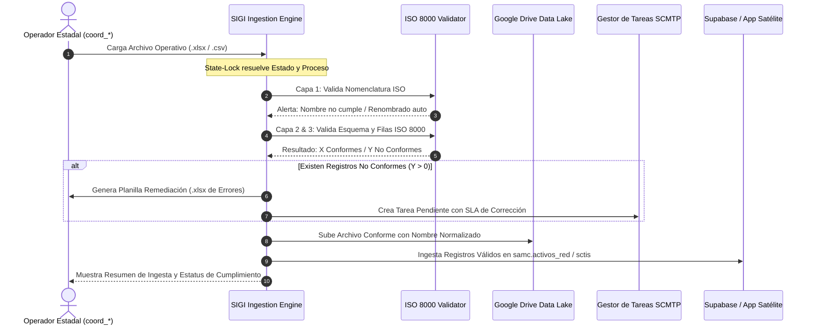

# PLAN ESTRATÉGICO Y DE ARQUITECTURA: MÓDULO DE INGESTA INTELIGENTE, CALIDAD DE DATOS (ISO 8000) Y AUTOMATIZACIÓN DE FLUJOS EN EL PORTAL SIGI

**DOCUMENTO NORMATIVO:** `NAC_2026_GGPD_PLAN_ESTRATEGICO_MODULO_INGESTA_CALIDAD_SIGI_V01.md`  
**NORMA INSTITUCIONAL:** GGPD-SGM-INS-005 (v3.0 ISO) / ISO 8000-110 / ISO 27001:2022 / COBIT 2019  
**DESTINATARIOS:** Gerente General de Planificación de Distribución | Jefes de División | Líderes Funcionales  
**ORIGEN:** Área de Innovación, Tecnología y Desarrollo Backend (GGPD)  
**FECHA DE FORMULACIÓN:** 14 de Agosto de 2026  
**ESTATUS:** Propuesta de Arquitectura y Factibilidad Técnica  

---

## 1. RESUMEN EJECUTIVO Y PROPÓSITO ESTRATÉGICO

La Gerencia General de Planificación de Distribución (GGPD) ha propuesto un salto cualitativo trascendental: **transformar el portal SIGI en el Epicentro Inteligente de Ingesta y Calidad de Datos del SEN**, erradicando de forma definitiva el tráfico no estructurado de información operativa vía WhatsApp y correo electrónico (*Directiva Zero-WhatsApp / Zero-Email*).

El sistema propuesto no solo centralizará la carga de archivos por proceso y estado, sino que actuará como un **Motor de Inteligencia de Datos (Data Quality Engine)** capaz de:
1. Validar la nomenclatura y estructura de esquemas en caliente.
2. Segregar registros **Conformes** (candidatos de carga) de registros **No Conformes** (aislados en bandeja de remediación).
3. Generar planillas `.xlsx` de corrección inmediata para el usuario estadal.
4. Crear automáticamente **Tareas de Corrección con SLA** en el sistema de gestión de tareas (SCMTP) para medir el desempeño de cada estado.
5. Almacenar la data conformada en una estructura estandarizada en el **Google Drive Oficial**, normalizando los nombres de archivos para que las aplicaciones satélites (SCTIS, SCEIN, SCPPE, SCMTP) la consuman de manera transparente.

---

## 2. ANÁLISIS DE FACTIBILIDAD TÉCNICA Y EVALUACIÓN CRÍTICA (CUESTIONAMIENTO ESPECIALISTA)

Como especialistas en arquitectura de software y gobierno de datos, evaluamos la solicitud como **100% FACTIBLE, ESTRATÉGICAMENTE ACERTADA Y ALINEADA A MEJORES PRÁCTICAS INTERNACIONALES**. 

No obstante, para garantizar su robustez y evitar riesgos operativos, aportamos las siguientes observaciones críticas y mejoras:

### ⚠️ Observación 1: Integridad Transaccional en Cargas Parciales (Conforme vs. No Conforme)
* **Desafío:** En procesos como *Tiras de Interrupción (SCTIS)*, un evento mayor de interrupción puede tener múltiples circuitos asociados. Si se aprueba una parte y se rechaza otra, podría fragmentarse el cálculo de Energía No Suministrada (ENS).
* **Solución Propuesta:** La segregación a nivel de registro aplicará una **regla de atomicidad**:
  * Registros independientes (ej. transformadores indisponibles en SCEIN o proyectos en SCPPE) se cargan de forma modular.
  * Registros con dependencia jerárquica (Cabecera-Detalle) ingresan a un estado de *Pre-Aprobación Condicionada* con advertencia al operador.

### ⚠️ Observación 2: Prevención de Duplicados en la Re-Carga de Archivos Corregidos
* **Desafío:** Cuando el usuario estadal descarga el archivo de errores, lo corrige y lo vuelve a subir, existe el riesgo de duplicar la data que ya fue aprobada en la primera carga.
* **Solución Propuesta:** Implementar un algoritmo de huella digital criptográfica (**SHA-256 Record Fingerprint**) y asignación de identificador único de lote (`batch_id`). Al reingresar el archivo corregido, el motor descarta automáticamente los registros ya existentes y absorbe exclusivamente los remediados.

### ⚠️ Observación 3: Cuotas de Google Drive y Concurrencia de 25 Estados
* **Desafío:** Si las 25 coordinaciones cargan sus cierres mensuales simultáneamente el día de corte, el Webhook de Google Apps Script podría experimentar latencia o límites de ejecución de 6 minutos.
* **Solución Propuesta:** El procesamiento pesado (validación sintáctica, parsing y deduplicación) se ejecuta **en el navegador del cliente (Client-Side Worker con Web Streams)**. A Google Drive y a Supabase solo se transmite el payload final limpio y empaquetado, reduciendo el tiempo de ejecución en la nube a menos de 800 milisegundos por estado.

---

## 3. ARQUITECTURA DEL FLUJO DE INGESTA INTELIGENTE (6 CAPAS)



---

## 4. MATRIZ DE NOMENCLATURA Y REGLAS DE VALIDACIÓN POR PROCESO

Para que el sistema "aprenda" la estructura de cada aplicación satélite, se definen los siguientes esquemas de validación:

| Proceso Operativo | Aplicación Destino | Nomenclatura Oficial ISO | Columnas Obligatorias / Reglas de Conformidad |
| :--- | :--- | :--- | :--- |
| **Tiras de Interrupción** | **SCTIS V2.0** | `SCTIS_[ESTADO]_[YYYYMMDD]_V[REV].xlsx` | • Fecha/Hora Apertura/Cierre válidas<br>• Código de Circuito existente en catálogo<br>• Causa codificada según norma SEN<br>• MW interrumpidos > 0 |
| **Equipos Indisponibles** | **SCEIN V3.0** | `SCEIN_[ESTADO]_[YYYYMMDD]_V[REV].xlsx` | • Código de Subestación homologado<br>• Tag de Equipo (Transformador, SF6, etc.)<br>• Diagnóstico preliminar no nulo<br>• Estatus de indisponibilidad válido |
| **Planes y Viáticos SAMC** | **SCPPE V3.0** | `SCPPE_[ESTADO]_[YYYYMMDD]_V[REV].xlsx` | • Código Proyecto POA/PRTSEN<br>• Partida presupuestaria válida<br>• Monto en Bs. y Divisas positivo<br>• Cédula y cargo del comisionado |
| **Minutas y Tareas** | **SCMTP V2.0** | `SCMTP_[ESTADO]_[YYYYMMDD]_V[REV].xlsx` | • Título de compromiso<br>• Responsable asignado<br>• Fecha límite de cumplimiento<br>• Estado (Pendiente / En Proceso) |

---

## 5. ESTRUCTURA NORMALIZADA DE CARPETAS EN GOOGLE DRIVE (DATA LAKE SEN)

La carpeta raíz institucional (`bk.ggpd.corpoelec@gmail.com` / ID: `1mnnChue2IUqOh5Or99_v2LiJ3TaRJvy7`) se estructurará de forma jerárquica y determinística:

```
📁 GGPD_DATA_LAKE_OFICIAL (Raíz ID: 1mnnChue2IUqOh5Or99_v2LiJ3TaRJvy7)
│
├── 📁 01_DCA_DISTRITO_CAPITAL/
│   ├── 📁 01_SCTIS_INTERRUPCIONES/
│   │   └── 📁 2026/
│   │       ├── 📁 08_AGOSTO/
│   │       │   ├── 📄 SCTIS_DCA_20260814_SEM32_V01.xlsx (Conforme)
│   │       │   └── 📄 SCTIS_DCA_20260814_SEM32_REMEDIACION.xlsx (Errores)
│   │       └── 📁 09_SEPTIEMBRE/
│   ├── 📁 02_SCEIN_INDISPONIBLES/
│   │   └── 📁 2026/
│   ├── 📁 03_SCPPE_PROYECTOS_VIATICOS/
│   │   └── 📁 2026/
│   └── 📁 04_SCMTP_MINUTAS_COMPROMISOS/
│       └── 📁 2026/
│
├── 📁 02_MIR_MIRANDA/
│   └── ... (Misma estructura de 4 procesos)
│
├── 📁 03_LGU_LA_GUAIRA/
│   └── ...
│
... (25 Carpetas Estadales hasta 25_GEQ_GUAYANA_ESEQUIBA)
│
└── 📁 99_CONSOLIDADOS_NACIONALES/
    ├── 📁 REPORTES_EJECUTIVOS_MPPEE/
    └── 📁 MATRICES_DEDUPLICADAS_ISO8000/
```

---

## 6. CONTROL DE PLAZOS Y CRONOGRAMA DE CONTROL OPERATIVO (SLAs)

Para medir el desempeño estadal y registrar indicadores en el tablero de control gerencial, se formalizan las siguientes ventanas de recepción:

```
CRONOGRAMA DE CONTROL OPERATIVO:
┌─────────────────────────────────────────────────────────────────────────────┐
│ 📅 CARGAS SEMANALES (Todos los Procesos):                                  │
│    • Apertura de Ventana: Miércoles 08:00 AM                                │
│    • Límite Ordinario: Jueves 12:00 PM (Mediodía)                           │
│    • Ventana Extraordinaria con Alerta SCMTP: Jueves 05:00 PM               │
├─────────────────────────────────────────────────────────────────────────────┤
│ 📊 CIERRES MENSUALES DE CONSOLIDACIÓN:                                      │
│    • Fecha Límite: 3er Día Hábil del mes posterior al cierre (03 o 3er DL)  │
│    • Generación de Acta de Consolidación Nacional: 4to Día Hábil            │
└─────────────────────────────────────────────────────────────────────────────┘
```

### Indicador de Desempeño Estadal (OTQR - On-Time Quality Rate):
$$OTQR = \left( \frac{\text{Registros Conformes a Tiempo}}{\text{Total Registros Exigidos}} \right) \times 100$$
* **Verde (Óptimo):** $\ge 95\%$ de registros conformes cargados dentro del plazo.
* **Amarillo (Alerta):** $80\% - 94\%$ o entrega en ventana extraordinaria.
* **Rojo (Crítico):** $< 80\%$ o registros no conformes sin subsanar tras 48 horas.

---

## 7. PLAN DE IMPLEMENTACIÓN Y FASES DE DESARROLLO

Para no interferir con el inicio programado de la fase de QA de las aplicaciones existentes, el desarrollo del Módulo de Ingesta Inteligente se estructurará en cuatro (4) sprints:

```
CRONOGRAMA DE IMPLEMENTACIÓN:
Sprint 1: UI del Módulo de Carga en SIGI (Tarjetas por Proceso y Drag & Drop)
Sprint 2: Motor de Validación Sintáctica ISO 8000 y Generador de Excel de Remediación
Sprint 3: Integración Bidireccional con Google Drive y Creación Automática de Tareas SCMTP
Sprint 4: Tablero de Desempeño Estadal (OTQR) y Conectores de Consumo en Apps Satélites
```

| Fase | Entregable Principal | Duración |
| :--- | :--- | :--- |
| **Fase I: Interfaz & Schemas** | Componente `DataIngestionHub.tsx` en SIGI con validación de esquemas JSON/Excel. | 3 Días |
| **Fase II: Motor de Calidad** | Separador Conforme/No Conforme + Exportador Excel de Remediación con columnas de error. | 4 Días |
| **Fase III: Storage & Tareas** | Script Google Apps Script con estructura de 25 estados + Webhook de creación de tareas en SCMTP. | 3 Días |
| **Fase IV: Auditoría & Telemetría** | Matriz de cumplimiento en vivo y consumo desde SCTIS, SCEIN, SCPPE. | 3 Días |

---

## 8. CONCLUSIÓN Y RECOMENDACIÓN

La implementación de este módulo convierte al **SIGI en la aduana digital única y definitiva de CORPOELEC (GGPD)**, cerrando la brecha de errores humanos, estandarizando la calidad del dato antes de su almacenamiento y automatizando el seguimiento de compromisos a nivel territorial.

Recomendamos **aprobar este plan conceptual y de arquitectura** para proceder a su construcción modular sin alterar la estabilidad de las aplicaciones satélites ya desplegadas.

---

**Atentamente,**

**Área de Innovación, Tecnología y Desarrollo Backend**  
Gerencia General de Planificación de Distribución (GGPD) — CORPOELEC  
*Norma de Documentación Institucional GGPD-SGM-INS-005 (v3.0 ISO)*  
