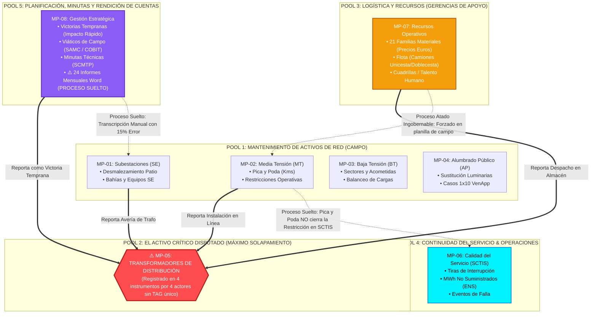
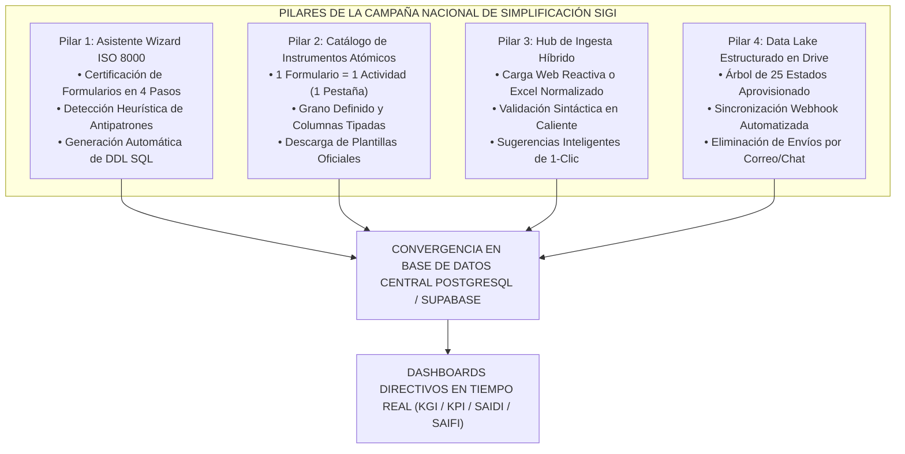

# MAPA DE INTERCONEXIÓN, SOLAPAMIENTOS Y BRECHAS DE PROCESOS OPERACIONALES
## EVALUACIÓN SISTÉMICA, PATOLOGÍA DEL DISEÑO DE INSTRUMENTOS Y BASES PARA LA CAMPAÑA NACIONAL DE SIMPLIFICACIÓN
### GERENCIA GENERAL DE PLANIFICACIÓN Y DISTRIBUCIÓN — CORPOELEC

---

**CÓDIGO NORMATIVO:** `GGPD-SGM-PRC-001 v2.0 ISO`  
**DOCUMENTO BASE:** `NAC_2026_GGPD_ANALISIS_INTERCONEXION_SOLAPAMIENTOS_PROCESOS_V01`  
**FECHA DE REVISIÓN:** 15 de Agosto de 2026  
**ALCANCE:** 8 Macro-Procesos / 28 Sub-Procesos Operacionales / 1.377 Instrumentos Evaluados  
**AUDIENCIA DESTINO:** Ingenieros de Planificación, Especialistas de Distribución, Auditores de Organización y Métodos (O&M), Coordinadores Estadales.  
**NORMAS APLICADAS:** ISO 9001:2015 (Enfoque de Procesos y Simplificación), ISO 8000-110 (Calidad de Datos Maestros), ISO 55000:2014 (Gestión de Activos Físicos), ISACA COBIT 2019 (Gobierno y Gestión de Información).

---

## 🏛️ 1. RESUMEN EJECUTIVO: LA NECESIDAD DE UNA CAMPAÑA DE SIMPLIFICACIÓN

El análisis técnico automatizado sobre los **1.377 archivos y 2.2 GB** de información operacional del ciclo 2026 arroja una conclusión categórica: **el volumen de trabajo y el nivel de detalle recopilado por los 25 estados es extraordinario, pero la arquitectura de los instrumentos utilizados sabotea el control centralizado.**

```
+----------------------------------------------------------------------------------------------------+
|                                RADIOGRAFÍA DEL ECOSISTEMA OPERACIONAL                              |
+----------------------------------------------------------------------------------------------------+
| • MACRO-PROCESOS OPERACIONALES:     8 Grandes Dominios de Gestión                                  |
| • SUB-PROCESOS / ACTIVIDADES:       28 Flujos de Trabajo Identificados                             |
| • PROCESOS CON ALTO SOLAPAMIENTO:   11 Sub-procesos (Data Duplicada y Tríplice Registro)          |
| • PROCESOS "SUELTOS" (SIN CONTROL): 7 Actividades Críticas Aisladas sin Retroalimentación         |
| • PROMEDIO DE PESTAÑAS POR EXCEL:   22 a 24 Hojas por Archivo Estadal                              |
| • ÍNDICE DE MADUREZ DE INSTRUMENTO: 31.4% (Nivel Inicial / Crítico)                                |
+----------------------------------------------------------------------------------------------------+
```

### 🎯 Propósito de la Campaña Nacional de Simplificación SIGI
Este informe no busca desestimar los formatos en uso, sino proveer la **evidencia técnica y científica** para iniciar la **Campaña Nacional de Simplificación y Normalización de Instrumentos**, impulsada por el **Módulo de Ingesta y el Asistente Wizard ISO 8000 del SIGI**, sustituyendo los libros de cálculo multifunción por **instrumentos atómicos, ligeros y certificados**.

---

## 🗺️ 2. CATÁLOGO DE LOS 8 MACRO-PROCESOS Y SUS 28 SUB-PROCESOS

| ID | Macro-Proceso | Sub-Procesos / Actividades Operativas Detectadas | Instrumentos de Control en Uso | Destino Arquitectónico SIGI |
| :---: | :--- | :--- | :--- | :---: |
| **MP-01** | **Mantenimiento de Subestaciones (SE)** | 1.1 Inspección y Diagnóstico de SE<br/>1.2 Mantenimiento Mayor / Menor de Bahías<br/>1.3 Desmalezamiento y Limpieza de Patio<br/>1.4 Seguimiento de Equipos Indisponibles<br/>1.5 Gestión de SE Móviles | Hoja `PLAN DE MTO SE`<br/>Hoja `DESMALEZAMIENTO SE`<br/>Hoja `SUBESTACIONES INDISPONIBLES`<br/>`SCEIN.xls` | **SCEIN V3.0** (:3005)<br/>+ `sigi.ingesta_06_scdes` |
| **MP-02** | **Mantenimiento de Redes de Media Tensión (MT)** | 2.1 Inspección de Corredores y Circuitos<br/>2.2 Pica y Poda de Vegetación<br/>2.3 Levantamiento de Restricciones Operativas<br/>2.4 Plan de Atención de Restricciones<br/>2.5 Mantenimiento de Equipos de Maniobra | Hoja `PICA Y PODA`<br/>Hoja `PLAN CIRCUITO MT`<br/>`REST_OPERATIVAS_CTOS.xlsx`<br/>`PLAN_ATENCION_CTOS.xlsx` | **SIGI Hub** (:3001)<br/>`sigi.ingesta_05_scpyp`<br/>`sigi.ingesta_08_scres` |
| **MP-03** | **Mantenimiento de Redes de Baja Tensión (BT)** | 3.1 Adecuación y Balanceo de Cargas BT<br/>3.2 Sustitución de Acometidas y Conductores<br/>3.3 Atención de Averías de Transformador BT | Hoja `MTTO DE BAJA TENSIÓN` | **SIGI Hub** (:3001)<br/>`sigi.ingesta_09_scbte` |
| **MP-04** | **Instalaciones de Alumbrado Público (AP)** | 4.1 Mantenimiento e Instalación de Luminarias<br/>4.2 Tasa de Falla y Reemplazo de AP<br/>4.3 Atención de Solicitudes Sistema 1x10 | Hoja `MTTO DE AP`<br/>Hoja `TASA DE ALUMBRADO`<br/>`1x10_Reportes.xlsx` | **SIGI Hub** (:3001)<br/>`sigi.ingesta_07_scalu` |
| **MP-05** | **Gestión de Transformadores de Distribución** | 5.1 Diagnóstico y Desincorporación de Averías<br/>5.2 Instalación y Reemplazo de Transformadores<br/>5.3 Tasa Mensual de Falla de Transformadores | Hoja `TRANSFORMADORES`<br/>Hoja `TASA DE TRANSFORMADORES`<br/>Planes de Contingencia | **MDM Central** (`activos_red`)<br/>+ SCPPE V3.0 |
| **MP-06** | **Calidad del Servicio e Interrupciones (SCTIS)** | 6.1 Tiras de Interrupción de Distribución<br/>6.2 Balance de Energía No Suministrada (MWh)<br/>6.3 Análisis de Líneas y Circuitos Indisponibles | Hoja `LINEAS INDISPONIBLES`<br/>`SCTIS_[EDO]_[FECHA].xlsx` | **SCTIS V2.0** (:3002)<br/>`sctis.tira_interrupcion` |
| **MP-07** | **Logística, Flota y Recursos Operativos** | 7.1 Requerimiento de Materiales (21 Familias)<br/>7.2 Control de Flota (Liviana, Cestas, Especiales)<br/>7.3 Inventario de Herramientas y Equipos<br/>7.4 Asignación de Cuadrillas y Talento Humano | Hoja `MATERIALES REQUERIDOS`<br/>Hojas `VEHICULOS`, `CAMIONES`<br/>Hoja `HERRAMIENTAS`<br/>Hoja `TALENTO HUMANO` | **SCPPE V3.0** (:3004)<br/>+ Catálogos MDM |
| **MP-08** | **Planificación, Viáticos y Minutas (SCMTP/SCPPE)** | 8.1 Planes Especiales y Victorias Tempranas<br/>8.2 Control Presupuestario de Viáticos (SAMC)<br/>8.3 Minutas y Acuerdos Técnicos<br/>8.4 Informes Mensuales de Rendición de Cuentas | `VICTORIAS_TEMPRANAS.xlsx`<br/>`005 INFORME DE GESTIÓN.docx`<br/>`MEMOS_METAS_2026.pdf` | **SCMTP V2.0** (:3003)<br/>**SCPPE V3.0** (:3004) |

---

## 🔄 3. MAPA DE CARRILES (SWIMLANES): INTERCONEXIÓN, SOLAPAMIENTOS Y PUNTOS CIEGOS



---

## 🔬 4. PATOLOGÍA DEL DISEÑO DE INSTRUMENTOS: LAS 6 TRAMPAS DEL MODELO LEGACY

Para promover la campaña de simplificación con los ingenieros, es vital tipificar con precisión pedagógica **por qué fallan los formularios actuales**:

```
+----------------------------------------------------------------------------------------------------+
|                               LAS 6 PATOLOGÍAS ESTRUCTURALES DEL DISEÑO EXCEL                      |
+----------------------------------------------------------------------------------------------------+
```

### 🔴 Trampa 1: El Instrumento "Mosaico Multifunción" (24 Pestañas)
* **Descripción:** Cada archivo de estado agrupa 24 hojas desconectadas entre sí en un solo libro `.xls`.
* **Efecto Operativo:** Para registrar 10 km de pica y poda ejecutados hoy, el ingeniero debe abrir un archivo de 4.5 MB, navegar entre 24 pestañas, sortear macros viejas y guardar. Esto propicia la omisión de datos y la fatiga administrativa.
* **Solución de Simplificación:** **Atomicidad.** Un instrumento es **1 solo archivo con 1 sola pestaña** especializada en ese sub-proceso.

### 🔴 Trampa 2: Celdas Combinadas y Encabezados en Múltiples Niveles
* **Descripción:** Encabezados en 3 o 4 filas combinadas (`MANTENIMIENTO PREVENTIVO > CORREDORES > MEDIA TENSIÓN > TRAMO`), seguidos de títulos fusionados verticalmente.
* **Efecto Operativo:** Invalida cualquier conector automatizado (Python, Node, PowerBI, SQL), forzando a que la consolidación de datos deba hacerse obligatoriamente a mano.
* **Solución de Simplificación:** **Fila Única de Encabezado (Fila 1).** Nombres de columna técnicos, unívocos y en mayúsculas (`COD_ESTADO`, `SUBESTACION`, `CIRCUITO`, `KMS_PODADOS`).

### 🔴 Trampa 3: Antipatrón 1NF (Grupos Repetitivos en Columnas Horizontales)
* **Descripción:** Diseñar columnas para cada mes del año (`ENE_META`, `FEB_META`... `DIC_META`) o para cada equipo (`TP1_KVA`, `TP2_KVA`, `TP3_KVA`).
* **Efecto Operativo:** Al comenzar el año siguiente o al intervenir una subestación con 4 transformadores, la hoja se rompe. El usuario altera la estructura agregando columnas, rompiendo la compatibilidad nacional.
* **Solución de Simplificación:** **Transaccionalidad Vertical.** Los meses y los transformadores son **filas de registros**, no columnas fijas.

### 🔴 Trampa 4: Antipatrón 3NF (Fórmulas y Filas de "TOTAL" dentro de la Data Cruda)
* **Descripción:** Intercalar filas de `SUBTOTAL ESTADAL` o celdas con fórmulas `=SUMA(D5:D48)` intercaladas en medio de las filas de circuitos.
* **Efecto Operativo:** Cuando el sistema central suma la columna nacional, cuenta las filas individuales **y también las filas de totales**, duplicando o triplicando artificialmente las métricas presentadas a la Dirección General.
* **Solución de Simplificación:** **Cero Fórmulas en la Tabla de Ingesta.** La tabla almacena solo hechos crudos. Los totales, porcentajes de avance y métricas KGI/KPI se calculan dinámicamente en la base de datos y se visualizan en los dashboards del SIGI.

### 🔴 Trampa 5: La "Celda Multifunción" (Texto Libre No Restringido)
* **Descripción:** Escribir en una sola celda de texto: `"S/E CHACAO TR-01 36KVA CON ACEITE DIEL."`.
* **Efecto Operativo:** Impide filtrar por nivel de tensión, por tipo de equipo o por marca.
* **Solución de Simplificación:** **Columnas Atómicas y Catálogos.** Separar en: `SUBESTACION` (Catálogo), `TAG_EQUIPO` (Texto), `TENSION_KV` (Numérico), `ESTADO_OPERATIVO` (Catálogo).

### 🔴 Trampa 6: El "Data Lake Local Duplicado" (871 SE y 4.207 Circuitos Embebidos)
* **Descripción:** Cada estado copia y pega la lista nacional de subestaciones y circuitos en pestañas ocultas (`CARACTERIZACION SE`).
* **Efecto Operativo:** Multiplicar 5.078 activos por 24 estados genera **121.872 registros redundantes desactualizados**.
* **Solución de Simplificación:** **Consumo MDM Centralizado.** Las listas desplegables se alimentan de la tabla maestra `sigi.activos_red` vía web o desde plantillas oficiales generadas por el SIGI.

---

## ⚡ 5. ANÁLISIS DE CASOS EMBLEMÁTICOS: SOLAPAMIENTOS Y PROCESOS SUELTOS

### 5.1. El Caso del "Transformador Fantasma" (Cuádruple Registro)
```
+----------------------------------------------------------------------------------------------------+
|                         EL CICLO DE VIDA FRACTURADO DE UN TRANSFORMADOR                            |
+----------------------------------------------------------------------------------------------------+
| 1. ALMACÉN:            Reporta despacho de 100 T/F en Euros        (Hoja MATERIALES)               |
| 2. MTO REDES:          Reporta instalación de 85 T/F por avería    (Hoja TRANSFORMADORES)          |
| 3. VICTORIAS TEMPRANAS:Reporta 140 T/F instalados como logro comunal(Archivo VICTORIAS TEMPRANAS)  |
| 4. SCTIS (CALIDAD):    Reporta 60 interrupciones por T/F quemados  (Hoja TIRAS SCTIS)              |
+----------------------------------------------------------------------------------------------------+
| RESULTADO DIRECTIVO:   4 cifras incompatibles para el mismo hecho físico (Sin Serial/TAG unificado) |
+----------------------------------------------------------------------------------------------------+
```

### 5.2. El Mantenimiento Condicionado a Recursos Ajenos (Proceso Atado)
* **El Error de Diseño:** Forzar al ingeniero de campo a responder en la planilla de pica y poda si el camión unicesta tenía cauchos operativos o si se disponía de combustible.
* **La Realidad O&M:** Esos recursos son administrados por Bienes y Servicios y Logística. Al exigir esa información en la hoja de campo, se bloquea el reporte del mantenimiento físico.
* **La Solución SIGI:** Desacoplar. Campo reporta metros podados; Logística reporta inventarios por su propio formulario. El SIGI los vincula mediante el `COD_ESTADO` y `FECHA`.

### 5.3. La Desconexión entre Mantenimiento y Calidad (Proceso Suelto)
* **El Hecho:** Las cuadrillas ejecutan mantenimiento intensivo en un circuito con restricción por vegetación.
* **La Falla:** La planilla de restricciones operativas no se entera del mantenimiento. El circuito continúa clasificado como "Vulnerable" en el Despacho de Carga.
* **La Solución SIGI:** La ingesta certificada de Pica y Poda emite un evento que **marca automáticamente la restricción como ATENDIDA** en la base de datos.

---

## 🚀 6. BASES PARA LA CAMPAÑA NACIONAL DE SIMPLIFICACIÓN Y NORMALIZACIÓN

La campaña nacional se fundamenta en **4 pilares estratégicos implementados en el SIGI**:



### 📋 El Decálogo del Instrumento Normalizado (Guía para Ingenieros)
Para que cualquier nuevo formato sea admitido por la GGPD, debe cumplir estas 10 reglas:
1. **Pestaña Única:** El archivo Excel debe contener una única hoja con los datos operativos.
2. **Encabezado en Fila 1:** Nombres de columna en mayúsculas, sin espacios ni caracteres especiales (`SUBESTACION`, `CIRCUITO`, `MW_AFECTADOS`).
3. **Cero Celdas Combinadas:** Ninguna celda del rango de datos debe estar fusionada.
4. **Cero Totales Intercalados:** Las sumatorias y promedios son responsabilidad del motor SQL.
5. **Tipado Estricto de Datos:** Fechas en formato `YYYY-MM-DD`, números limpios sin símbolos (`14.5`, no `"14,5 MW"`).
6. **Vinculación a Catálogos MDM:** Nombres de subestaciones, circuitos y materiales deben coincidir con el catálogo maestro central.
7. **Nomenclatura Estandarizada del Archivo:** `PROCESO_ESTADO_YYYYMMDD_V01.xlsx`.
8. **Inclusión Obligatoria del Código de Estado:** Campo `COD_ESTADO` presente en cada fila (`DCA`, `ZUL`, `MIR`).
9. **Desacoplamiento de Recursos Administrativos:** No incluir campos de nómina o combustible en formatos de mantenimiento eléctrico.
10. **Certificación Previa en el Wizard SIGI:** Todo instrumento debe contar con el dictamen de conformidad del Asistente Wizard antes de ser emitido a los estados.

---

## 📈 7. HOJA DE RUTA PARA LA IMPLEMENTACIÓN DE LA CAMPAÑA

```
FASE 1: CONCILIACIÓN & CERTIFICACIÓN (Semanas 1 - 2)
  ├── Pasar los 5 borradores 2026 por el Asistente Wizard ISO 8000 en SIGI.
  ├── Emitir las 5 Plantillas Oficiales Atómicas (.xlsx de 1 pestaña).
  └── Publicar el DDL en el esquema sigi de PostgreSQL/Supabase.

FASE 2: DESPLIEGUE EN EL DATA LAKE (Semanas 3 - 4)
  ├── Aprovisionar las carpetas de las 5 plantillas en los 25 estados de Google Drive.
  └── Habilitar la bandeja de ingesta y carga híbrida en el portal SIGI.

FASE 3: TALLERES TÉCNICOS CON LOS 25 ESTADOS (Semanas 5 - 6)
  ├── Demostración a los coordinadores estadales: "Cómo llenar la plantilla de 1 pestaña en 5 minutos".
  └── Capacitación en el uso del Formulario Web Reactivo y resolución de sugerencias de 1-clic.

FASE 4: APAGADO GRADUAL DEL MODELO LEGACY (Semana 7 en adelante)
  ├── Desincorporación formal de los libros de 24 pestañas.
  └── Generación automática de los Informes de Gestión Directiva desde los Dashboards SIGI.
```

---

**DOCUMENTO CERTIFICADO POR:**  
*Gerencia General de Planificación y Distribución (GGPD) — Comité de Arquitectura y Gobernanza de Datos.*  
*Registrado en la Bitácora Inmutable bajo Hash Criptográfico SHA-256.*
