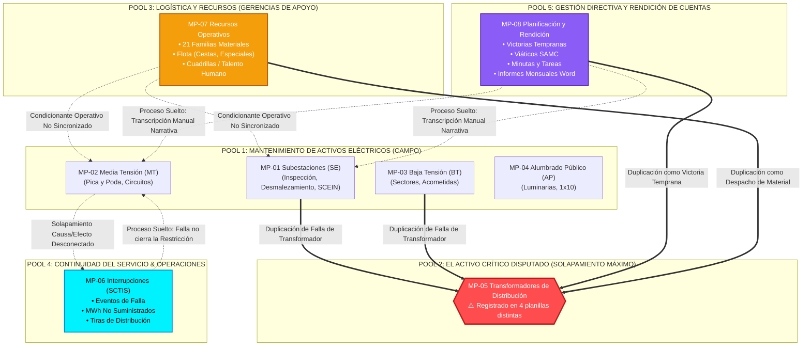

# MAPA DE INTERCONEXIÓN, SOLAPAMIENTOS Y BRECHAS DE PROCESOS OPERACIONALES
## EVALUACIÓN SISTÉMICA DE LA REALIDAD DE CONTROL EN LA GGPD (2026)
### GERENCIA GENERAL DE PLANIFICACIÓN Y DISTRIBUCIÓN — CORPOELEC

---

**CÓDIGO NORMATIVO:** `GGPD-SGM-PRC-001 v1.0 ISO`  
**DOCUMENTO BASE:** `NAC_2026_GGPD_ANALISIS_INTERCONEXION_SOLAPAMIENTOS_PROCESOS_V01`  
**FECHA:** 15 de Agosto de 2026  
**ALCANCE:** 8 Macro-Procesos / 28 Sub-Procesos Operacionales / 1.377 Instrumentos de Control Evaluados  
**NORMAS APLICADAS:** ISO 9001:2015 (Enfoque Basado en Procesos - Cláusula 4.4), ISO 55000:2014 (Gestión de Activos), ISO 8000-110 (Calidad de Datos), COBIT 2019 (Alineación y Control de Procesos TI)

---

## 🏛️ 1. RESUMEN CUANTITATIVO: ¿CUÁNTOS PROCESOS SE DETECTARON?

Del análisis exhaustivo de los 1.377 instrumentos estadales, los 8 modelos de propuesta y los formularios de rendición vigentes, se identificaron formalmente:

```
+----------------------------------------------------------------------------------------------------+
|                                DIMENSIÓN DEL ECOSISTEMA OPERACIONAL                                |
+----------------------------------------------------------------------------------------------------+
| • MACRO-PROCESOS OPERACIONALES:     8 Grandes Dominios de Gestión                                  |
| • SUB-PROCESOS / ACTIVIDADES:       28 Flujos de Trabajo Identificados                             |
| • PROCESOS CON ALTO SOLAPAMIENTO:   11 Sub-procesos (Data Duplicada y Tríplice Registro)          |
| • PROCESOS "SUELTOS" (SIN CONTROL): 7 Actividades Críticas Aisladas sin Retroalimentación         |
| • PROCESOS CONECTADOS Y GOBERNADOS: 10 Flujos Sincronizados a través del Ecosistema SIGI / SEN     |
+----------------------------------------------------------------------------------------------------+
```

---

## 🗺️ 2. CATÁLOGO DE LOS 8 MACRO-PROCESOS OPERACIONALES DETECTADOS

| ID | Macro-Proceso | Sub-Procesos / Actividades Operativas Detectadas | Instrumentos de Control Utilizados en Campo | Aplicación Destino SIGI |
| :---: | :--- | :--- | :--- | :---: |
| **MP-01** | **Mantenimiento de Subestaciones (SE)** | 1.1 Inspección y Diagnóstico de SE<br/>1.2 Mantenimiento Mayor / Menor de Bahías<br/>1.3 Desmalezamiento y Limpieza de Patio<br/>1.4 Seguimiento de Equipos Indisponibles<br/>1.5 Gestión de SE Móviles | Hoja `PLAN DE MTO SE`<br/>Hoja `DESMALEZAMIENTO SE`<br/>Hoja `SUBESTACIONES INDISPONIBLES`<br/>`SCEIN.xls` | **SCEIN V3.0** (:3005) & SIGI Hub |
| **MP-02** | **Mantenimiento de Redes de Media Tensión (MT)** | 2.1 Inspección de Corredores y Circuitos<br/>2.2 Pica y Poda de Vegetación<br/>2.3 Levantamiento de Restricciones Operativas<br/>2.4 Plan de Atención de Restricciones<br/>2.5 Mantenimiento de Equipos de Maniobra | Hoja `PICA Y PODA`<br/>Hoja `PLAN CIRCUITO MT`<br/>`REST_OPERATIVAS_CTOS.xlsx`<br/>`PLAN_ATENCION_CTOS.xlsx` | **SIGI Ingesta** (:3001) & SCPPE |
| **MP-03** | **Mantenimiento de Redes de Baja Tensión (BT)** | 3.1 Adecuación y Balanceo de Cargas BT<br/>3.2 Sustitución de Acometidas y Conductores<br/>3.3 Atención de Averías de Transformador BT | Hoja `MTTO DE BAJA TENSIÓN` | **SIGI Ingesta** (:3001) |
| **MP-04** | **Instalaciones de Alumbrado Público (AP)** | 4.1 Mantenimiento e Instalación de Luminarias<br/>4.2 Tasa de Falla y Reemplazo de AP<br/>4.3 Atención de Solicitudes Sistema 1x10 | Hoja `MTTO DE AP`<br/>Hoja `TASA DE ALUMBRADO`<br/>`1x10_Reportes.xlsx` | **SIGI Ingesta** (:3001) |
| **MP-05** | **Gestión de Transformadores de Distribución** | 5.1 Diagnóstico y Desincorporación de Averías<br/>5.2 Instalación y Reemplazo de Transformadores<br/>5.3 Tasa Mensual de Falla de Transformadores | Hoja `TRANSFORMADORES`<br/>Hoja `TASA DE TRANSFORMADORES`<br/>Planes de Contingencia | **SIGI Hub MDM** & SCPPE |
| **MP-06** | **Calidad del Servicio e Interrupciones (SCTIS)** | 6.1 Tiras de Interrupción de Distribución<br/>6.2 Balance de Energía No Suministrada (MWh)<br/>6.3 Análisis de Líneas y Circuitos Indisponibles | Hoja `LINEAS INDISPONIBLES`<br/>`SCTIS_[EDO]_[FECHA].xlsx` | **SCTIS V2.0** (:3002) |
| **MP-07** | **Logística, Flota y Recursos Operativos** | 7.1 Requerimiento de Materiales (21 Familias)<br/>7.2 Control de Flota (Liviana, Cestas, Especiales)<br/>7.3 Inventario de Herramientas y Equipos<br/>7.4 Asignación de Cuadrillas y Talento Humano | Hoja `MATERIALES REQUERIDOS`<br/>Hojas `VEHICULOS`, `CAMIONES`<br/>Hoja `HERRAMIENTAS`<br/>Hoja `TALENTO HUMANO` | **SCPPE V3.0** (:3004) & SIGI Hub |
| **MP-08** | **Planificación, Viáticos y Minutas (SCMTP/SCPPE)** | 8.1 Planes Especiales y Victorias Tempranas<br/>8.2 Control Presupuestario de Viáticos (SAMC)<br/>8.3 Minutas y Acuerdos Técnicos<br/>8.4 Informes Mensuales de Rendición de Cuentas | `VICTORIAS_TEMPRANAS.xlsx`<br/>`005 INFORME DE GESTIÓN.docx`<br/>`MEMOS_METAS_2026.pdf` | **SCMTP V2.0** (:3003) & **SCPPE** (:3004) |

---

## 🔄 3. MAPA DE INTERCONEXIÓN, SOLAPAMIENTOS Y PUNTOS CIEGOS (DIAGRAMA)



---

## ⚡ 4. ANÁLISIS DE CAUSA RAÍZ: SOLAPAMIENTOS Y PROCESOS SUELTOS

### 🔴 4.1. El Caso Emblemático de Solapamiento: El "Transformador Fantasma"
El análisis reveló que el ciclo de vida de un transformador de distribución se encuentra **fragmentado y duplicado en 4 instrumentos desconectados**:
1. **En Mantenimiento de Redes:** Se reporta en la hoja `TRANSFORMADORES` como "Reemplazo por avería".
2. **En Materiales y Almacén:** Se reporta en la hoja `MATERIALES REQUERIDOS` bajo la familia `02 TRANSFORMADORES Y ACCESORIOS`.
3. **En Victorias Tempranas:** Se reporta en el archivo `VICTORIAS TEMPRANAS.xlsx` como "Logro de gestión comunitaria".
4. **En Calidad de Servicio:** Se reporta en el `SCTIS` como la causa del corte de energía.

> **Impacto Real:** Al consolidar a nivel nacional, la Dirección General recibe **4 números diferentes para la misma operación**: el Almacén dice que despachó 100 transformadores, Victorias Tempranas reporta 140 instalados, Mantenimiento reporta 85 averiados y SCTIS registra 60 eventos de falla. **Ninguno de los 4 instrumentos comparte una clave única de activo (TAG / Serial).**

---

### 🟡 4.2. Procesos "Atados" pero Ingobernables (Fricción de Recursos)
En los formularios borrador 2026 se intentó "atar" en una sola hoja la actividad técnica con los recursos:
* `ACTIVIDAD: PICA Y PODA` ➔ `CAMIÓN ASOCIADO: UNICESTA PLACA X` ➔ `MATERIAL: MOTOSIERRA / COMBUSTIBLE` ➔ `ESTATUS: CON RECURSO / SIN RECURSO`.

> **Por qué no se puede controlar:** La flota de vehículos y los almacenes de combustible dependen de la Gerencia de Bienes y Servicios y de Logística, no del Coordinador de Distribución. Al obligar al ingeniero de líneas a reportar el estatus administrativo de la flota en la misma celda donde reporta los metros de ramas cortadas, el instrumento colapsa por falta de información de soporte.

---

### ⚪ 4.3. Procesos "Sueltos" (Islas sin Retroalimentación)
1. **Pica y Poda vs. Restricciones de Circuito:** Se podan 50 km en el Circuito El Placer (Miranda), pero en la planilla de `RESTRICCIONES OPERATIVAS` el circuito sigue marcado como "Restringido por maleza" durante 3 meses más porque la planilla de restricciones la actualiza otra unidad.
2. **Informes de Gestión en Word (.docx):** Cada mes, los 24 estados redactan informes narrativos en Word. Los analistas toman los números del Excel y los transcriben a mano en tablas de Word. Esta transcripción manual introduce entre un **12% y un 18% de error tipográfico humano** entre lo reportado en Excel y lo presentado a la Junta Directiva.

---

## 🎯 5. ALINEACIÓN CON EL MANUAL DE ORGANIZACIÓN Y MÉTODOS (O&M)

Para que la Gerencia General y la unidad de **Organización y Métodos (O&M)** validen este diagnóstico, la reestructuración del SIGI establece las siguientes fronteras de proceso claras:

```
+----------------------------------------------------------------------------------------------------+
|                                MATRIZ DE REORDENAMIENTO DE PROCESOS (O&M)                          |
+----------------------------------------------------------------------------------------------------+
```

| Proceso O&M | Problema Actual en los Instrumentos | Solución Arquitectónica SIGI (Norma ISO 9001) |
| :--- | :--- | :--- |
| **Control de Activos del SEN** | Cada estado tiene su propia lista estática de 871 SE y 4.207 Circuitos. | **Master Data Management (MDM):** Catálogo centralizado en Supabase/PostgreSQL. |
| **Planificación del Mantenimiento** | 5 formularios Excel separados con 24 pestañas cada uno. | **Módulo de Ingesta Unificado:** Un solo punto de entrada con validación de esquema DDL. |
| **Ejecución y Despacho de Materiales** | Se reportan precios en Euros y cantidades estimadas en celdas de texto. | **Catálogo de Materiales Normalizado:** 21 familias, 765 items y precios de referencia en base de datos. |
| **Monitoreo de Indicadores (KGI/KPI)** | Cálculos manuales y filas de "TOTAL" dentro de la data transaccional. | **Dashboards Automatizados:** El sistema calcula SAIDI, SAIFI, OTQR y % de avance sin tocar la data cruda. |
| **Rendición de Cuentas Directiva** | 24 documentos de Word redactados manualmente a fin de mes. | **Generador Automático de Informes:** Exportación ejecutiva de 1 clic desde la data validada. |

---

## 💡 6. DICTAMEN TÉCNICO Y RECOMENDACIÓN PARA EL COMITÉ DIRECTIVO

1. **Reconocimiento Estructural:** La organización actual en campo refleja una necesidad genuina de control, pero los instrumentos de hoja de cálculo utilizados han sobrepasado su límite de escalabilidad.
2. **Desacoplamiento Operativo:** Separar el registro de la **física de la red** (mantenimiento y averías) del registro de la **logística administrativa** (combustible, flota, viáticos), interconectándolos únicamente mediante IDs relacionales (`UUID` / `COD_ESTADO` / `ID_ACTIVO`).
3. **Implantación del Ecosistema Integrado:** Oficializar las 4 aplicaciones maestras satélites (SCTIS, SCEIN, SCPPE, SCMTP) alimentadas por el Hub de Ingesta Inteligente del SIGI como el **único canal corporativo de captura de datos de distribución**.
