# Mapeo de Orígenes, Rutas y Diagnóstico de Correspondencia GGP — CORPOELEC (SCGCC)

---

## 📌 1. Ficha Técnica y Registro de Directorios Oficiales en Google Drive

- **Cuenta Propietaria / Custodia:** `bk.ggpd.corpoelec@gmail.com`
- **Carpeta Raíz Data Lake GGPD:** `1mnnChue2IUqOh5Or99_v2LiJ3TaRJvy7`
- **Carpeta Raíz SCGCC 2026 (en `_Gerencia Nacional`):** `1s5sOV__H7WbJRhsNHAqWgR8BIj0XHlI7`
- **Webhook Oficial Apps Script:** `https://script.google.com/macros/s/AKfycbxonVU31GBXuVCfu_5G8hmADkYFB7yriPJVt2nS9w7uMjsERu5_WPzpQSVbuB2kvtQkqA/exec`

---

## 🗂️ 2. Matriz de Directorios y Archivos de Correspondencia

| N° | Directorio / Nombre en Drive | Folder ID en Google Drive | URL de Acceso en Nube | Tipo de Contenido / Propósito |
| :-: | :--- | :--- | :--- | :--- |
| **0** | **`00_CORRESPONDENCIA_SCGCC_2026`** *(Bóveda Central Canónica)* | `1s5sOV__H7WbJRhsNHAqWgR8BIj0XHlI7` | [Abrir en Drive](https://drive.google.com/drive/folders/1s5sOV__H7WbJRhsNHAqWgR8BIj0XHlI7) | **Bóveda Oficial SCGCC 2026** (Entradas Radicadas, Salidas Despachadas, Plantillas y Respaldos ISO 15489). |
| **1** | **`_Gerencia Nacional`** *(Contiene `REGISTRO DE LA CORRESPONDENCIA RECIBIDA GGP.xlsx`)* | `1yKwQ8hKGjCPHwukuADkv__Kp3gicJkBj` | [Abrir en Drive](https://drive.google.com/drive/folders/1yKwQ8hKGjCPHwukuADkv__Kp3gicJkBj) | Directorio Contenedor Madre de Despacho y Registro Principal GGP. |
| **2** | **`Gestion de Correspondencia GGP`** | `1rxcoAzXeBRPYOiKLWNmVWvKnPkF46Qfy` | [Abrir en Drive](https://drive.google.com/drive/folders/1rxcoAzXeBRPYOiKLWNmVWvKnPkF46Qfy) | Registro y correlativos de correspondencias emitidas (salidas) por la GGP. |
| **3** | **`PDF CORRESP TTHH  2026`** | `1TLY85lMR7R1Yz7TgKaMVc2p42dgSO07D` | [Abrir en Drive](https://drive.google.com/drive/folders/1TLY85lMR7R1Yz7TgKaMVc2p42dgSO07D) | Expedientes digitales en PDF de comunicaciones emitidas por la Gerencia de Talento Humano hacia la GGP. |
| **4** | **`PDF DOC. CORRESP GCIA GRAL DE DISTRIBUCION A LA GGP`** | `1LHRo1PlKxPRHYFSOJsdemq8iXO8SNMRf` | [Abrir en Drive](https://drive.google.com/drive/folders/1LHRo1PlKxPRHYFSOJsdemq8iXO8SNMRf) | Expedientes digitales en PDF emitidos por la Gerencia General de Distribución (GGPD) dirigidos a la GGP. |
| **5** | **`FORMATO CORPORATIVOS VARIOS 2026`** | `1-e_OVf929QnJkUUcXUFRy_pCujAdF26a` | [Abrir en Drive](https://drive.google.com/drive/folders/1-e_OVf929QnJkUUcXUFRy_pCujAdF26a) | Plantillas oficiales en Word/Excel para memorándums, oficios, puntos de cuenta y notas de entrega. |

---

## 🔎 3. Diagnóstico Preliminar: Riesgos de Proceso y Síntomas de Descontrol

A partir del análisis estructural de estas carpetas, se identifican **4 fallas procedimentales críticas** en la gestión tradicional de correspondencia:

```mermaid
flowchart TD
    subgraph Actual["❌ Flujo Tradicional Inconsistente (Descontrol)"]
        F1["Libro Excel Desconectado<br/>('REGISTRO...xlsx')"] -.->|Sin validación| F2["PDFs en Carpetas Sueltas<br/>(TTHH, Distribución)"]
        F2 -.->|Sin enlace| F3["Correlativos Manuales<br/>(Riesgo de saltos o duplicados)"]
        F3 -.->|Desconocido| F4["¿Quién atendió la solicitud?<br/>¿Cuándo venció el plazo?"]
    end

    subgraph Solucion["✅ Solución SCGCC V1.0 (Gobernanza ISO 15489)"]
        S1["Radicación Única 1-Clic<br/>(Correlativo Automático)"] ==> S2["Bóveda Digital Inmutable<br/>(Checksum SHA-256 + PDF)"]
        S2 ==> S3["Asignación de Responsable & SLA<br/>(Alerta de Vencimiento)"]
        S3 ==> S4["Derivación de Tareas SCMTP<br/>(Trazabilidad 100% Cerrada)"]
    end
```



### Síntomas Detectados:
1. **Desacoplamiento entre Registro y Soporte Digital:** El archivo `REGISTRO DE LA CORRESPONDENCIA RECIBIDA GGP.xlsx` suele registrar números de oficio en texto plano sin hipervínculos garantizados a los PDFs en las carpetas `PDF CORRESP TTHH 2026` o `PDF DOC. CORRESP...`. Si alguien renombra un PDF, se pierde el rastro.
2. **Silos por Remitente en lugar de Libro de Radicación Único:** Tener carpetas separadas para "Talento Humano" y "Gerencia General de Distribución" fragmenta la auditoría. Bajo norma ISO 15489, debe existir un **Índice Canónico Único** con atributo `remitente_institucion` / `remitente_unidad`.
3. **Ausencia de Trazabilidad de Ciclo de Vida (SLA de Respuesta):** No hay forma confiable en Excel de saber si una correspondencia fue atendida, si generó una respuesta formal con número de oficio de salida, o si el plazo legal de respuesta expiró.
4. **Falta de Segregación de Confidencialidad (ISO 27001):** Todo usuario con acceso a la carpeta de Drive puede ver tanto memorándums ordinarios de rutina como comunicaciones confidenciales de talento humano o sanciones/auditorías.

---

---

## 🏛️ 4. Arquitectura de la Bóveda Canónica `00_CORRESPONDENCIA_SCGCC_2026`

```
📁 _Gerencia Nacional (ID: 1yKwQ8hKGjCPHwukuADkv__Kp3gicJkBj)
│
└── 📁 00_CORRESPONDENCIA_SCGCC_2026/ (ID: 1s5sOV__H7WbJRhsNHAqWgR8BIj0XHlI7)
    │
    ├── 📁 01_ENTRADAS_RADICADAS/
    │   ├── 📁 01_MPPEE_Y_PRESIDENCIA/          (Instrucciones ministeriales y presidenciales)
    │   ├── 📁 02_GERENCIA_GRAL_DISTRIBUCION/   (Comunicaciones de la GGD)
    │   ├── 📁 03_TALENTO_HUMANO_TTHH/          (Memorándums y expedientes de personal)
    │   └── 📁 04_OTRAS_GERENCIAS_Y_EXTERNOS/   (1x10, entes regionales, gobernaciones)
    │
    ├── 📁 02_SALIDAS_DESPACHADAS/
    │   ├── 📁 01_OFICIOS_FIRMADOS_CON_ACUSE/   (PDFs finales firmados con sello de recibido)
    │   └── 📁 02_MEMORANDUMS_EMITIDOS/         (Memos internos despachados)
    │
    ├── 📁 03_PLANTILLAS_FORMATOS_2026/      (Formatos Word/Excel homologados)
    │
    └── 📁 04_RESPALDOS_AUDITORIA_SCGCC/     (Snapshots periódicos JSON/SQL de InsForge)
```

---

## 🚀 5. Próximo Paso para Descarga, Aprovisionamiento y Extracción Local

1. Actualizar el script en Google Apps Script con [`scripts/google_apps_script_provisioner_2026.gs`](file:///home/skidrowkodex/Documentos/Repositorio_Maestro/scripts/google_apps_script_provisioner_2026.gs) (Versión **3.2.0**).
2. Ejecutar la función `provisionScgccStructure()` en la consola de Google Apps Script para auto-aprovisionar las subcarpetas normativas en 1 clic.
3. Ejecutar el script extractor local [`scripts/fetch_correspondencia_data.js`](file:///home/skidrowkodex/Documentos/Repositorio_Maestro/scripts/fetch_correspondencia_data.js) para traer a `data/correspondencia_raw/` los archivos y realizar la auditoría sintáctica y semántica del Excel `REGISTRO DE LA CORRESPONDENCIA RECIBIDA GGP.xlsx`.
