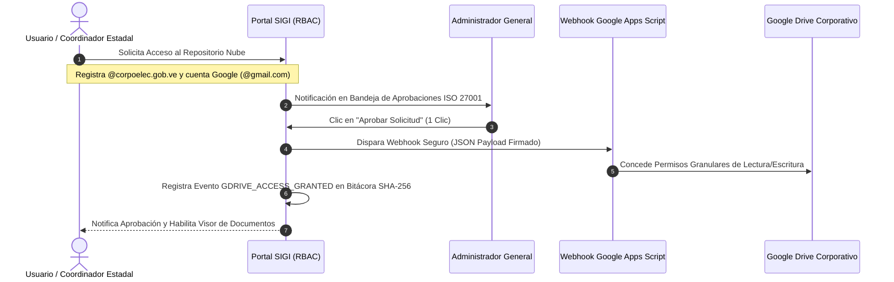
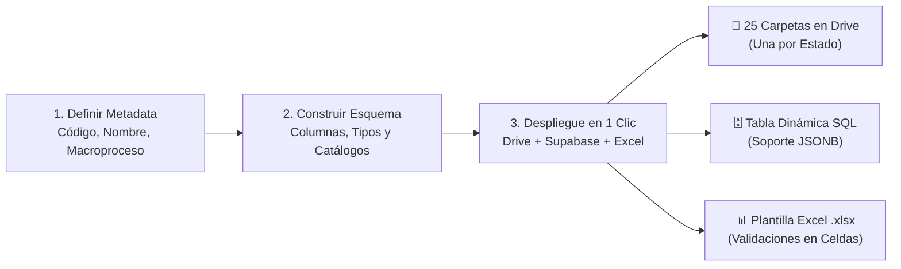
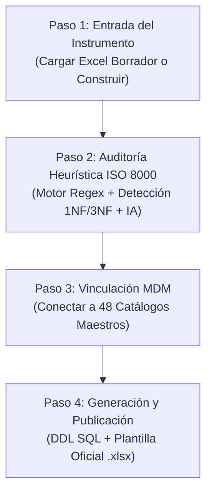
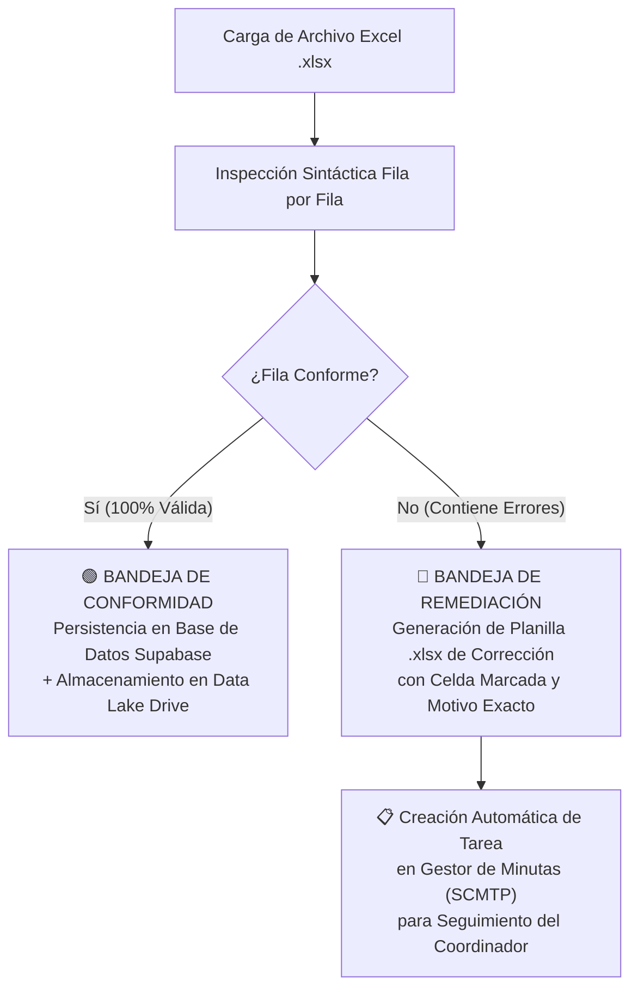

# ⚡ PRESENTACIÓN CORPORATIVA & GUÍA ESTRATÉGICA PARA DECISORES
## SISTEMA INTEGRADO DE GESTIÓN DE LA INFORMACIÓN (SIGI GGPD 2026)
### DATA LAKE EN GOOGLE DRIVE, APROVISIONAMIENTO DINÁMICO DE PROCESOS Y ASISTENTE WIZARD ISO 8000

---

**Código de Documento:** `NAC_2026_GGPD_PRESENTACION_EJECUTIVA_SIGI_DATA_LAKE_ISO8000_V01`  
**Norma de Homologación:** `GGPD-SGM-PRE-001 v1.0 ISO`  
**Destinatarios:** Junta Directiva, Gerente General de Distribución (GGPD), Gerentes Estadales, Coordinadores de Planificación, Auditores de Calidad y Jefes de Proceso.  
**Autoría Técnica:** Gerencia General de Planificación de Distribución (GGPD) / Antigravity IDE 2.0  
**Fecha de Emisión:** Agosto 2026  
**Clasificación de Seguridad:** Confidencial / Uso Oficial Institucional  

---

```
========================================================================================
    REPÚBLICA BOLIVARIANA DE VENEZUELA · MINISTERIO DEL PODER POPULAR PARA LA ENERGÍA ELÉCTRICA
                 CORPORACIÓN ELÉCTRICA NACIONAL, S.A. (CORPOELEC)
              GERENCIA GENERAL DE PLANIFICACIÓN DE DISTRIBUCIÓN (GGPD)
========================================================================================
```

---

## 📑 TABLA DE CONTENIDO EJECUTIVO

1. **Módulo 1:** Visión Estratégica & Propuesta de Valor para la Alta Gerencia.
2. **Módulo 2:** Data Lake Estructurado en Google Drive 2026: De Carpetas Caóticas a Almacenamiento Auditado.
3. **Módulo 3:** Creación y Aprovisionamiento Dinámico de Procesos en Tiempo Real (Paso a Paso).
4. **Módulo 4:** El Asistente Wizard ISO 8000: Diseño, Normalización y Auditoría Heurística de Formularios.
5. **Módulo 5:** El Hub de Ingesta Inteligente Multimodal & Motor de Remediación Fila por Fila.
6. **Módulo 6:** Gobernanza de Seguridad ISO 27001, Doble Cuenta y Matriz de 25 Cuentas Estadales.
7. **Módulo 7:** Caso Práctico de Extremo a Extremo: Del Requerimiento a la Telemetría Nacional.
8. **Módulo 8:** Conclusiones, Retorno de Inversión y Decálogo de Adopción Estratégica.

---

## 🎯 MÓDULO 1: VISIÓN ESTRATÉGICA & PROPUESTA DE VALOR PARA LA ALTA GERENCIA

### 1.1. El Diagnóstico: La Trampa de la Fragmentación de Datos (El "Ecosistema WhatsApp")
Durante años, la gestión operativa de la distribución eléctrica nacional ha enfrentado un desafío estructural: **la dispersión de la información**.
* **El Problema Operativo:** Las 25 Coordinaciones Estadales envían reportes diarios y semanales a través de canales no estructurados (chats de mensajería instantánea, correos personales, archivos Excel heterogéneos con celdas combinadas y formatos variables).
* **El Impacto en la Toma de Decisiones:**
  * **Ceguera Operativa Temporal:** Consolidar los datos de 2.480 circuitos y 838 subestaciones tardaba entre **10 y 21 días**, haciendo que las decisiones gerenciales se tomaran sobre información desactualizada.
  * **Inconsistencia Sintáctica:** Cada estado reportaba con su propio criterio (ejemplo: "S/E Centro", "Subestacion El Centro", "SE-CENTRO 115kV").
  * **Vulnerabilidad de Custodia (Riesgo ISO 27001):** Datos estratégicos del SEN almacenados en teléfonos particulares sin trazabilidad ni respaldo inmutable.

### 1.2. La Solución Transformadora: El Sistema SIGI
El **SIGI (Sistema Integrado de Gestión de la Información)** es el centro neurálgico de la GGPD que convierte datos dispersos en **Inteligencia Operativa y Activos Estratégicos Confiables**, operando bajo 5 normas internacionales:

```
┌──────────────────────────────────────────────────────────────────────────────────────────┐
│                                PILARES NORMATIVOS DEL SIGI                               │
├──────────────────────┬──────────────────────┬─────────────────────┬──────────────────────┤
│      ISO 8000        │  ISO/IEC 27001:2022  │   ISACA COBIT 2019  │  ISO 55000 / 55001   │
│ Calidad Sintáctica y │ Control de Acceso,   │ Controles Financie- │ Ciclo de Vida y      │
│ Semántica de Datos   │ Cifrado y Bitácora   │ ros Preventivos     │ Trazabilidad de      │
│ (Cero Duplicados)    │ SHA-256 Inmutable    │ (Triggers Automát.) │ Activos del SEN      │
└──────────────────────┴──────────────────────┴─────────────────────┴──────────────────────┘
```

### 1.3. Cuadro Comparativo de Impacto Institucional (Antes vs. Después)

| Parámetro Operativo | Modelo Anterior (Manual / Excel Aislado) | Modelo SIGI GGPD 2026 | Beneficio para el Decisor |
| :--- | :--- | :--- | :--- |
| **Tiempo de Consolidación Nacional** | 2 a 3 Semanas | **Tiempo Real (< 5 Segundos)** | Agilidad táctica inmediata ante contingencias en el SEN. |
| **Calidad y Validación de Datos** | Manual y propensa a error humano | **Validación Sintáctica en Caliente (OTQR)** | Certeza técnica del 100% en auditorías ministeriales. |
| **Estandarización Territorial** | 25 criterios estadales dispares | **Catálogos Maestros Homologados (MDM)** | Lenguaje unificado en todo el territorio nacional. |
| **Trazabilidad y Responsabilidad** | Desconocida / Chats borrados | **Firma Criptográfica y Bitácora ISO 27001** | Custodia legal y técnica inalterable. |
| **Flexibilidad ante Nuevos Procesos** | Meses de desarrollo de software | **Creación Dinámica en 3 Clics** | Capacidad de respuesta inmediata a nuevos planes. |

---

## ☁️ MÓDULO 2: DATA LAKE ESTRUCTURADO EN GOOGLE DRIVE 2026

### 2.1. Concepto Pedagógico: ¿Qué es el Data Lake Estructurado?
A diferencia de un Google Drive tradicional —donde cada usuario crea carpetas a discreción generando caos documental—, el **Data Lake Estructurado 2026** de la GGPD es una **infraestructura jerárquica aprovisionada automáticamente por código** mediante Google Apps Script.

### 2.2. La Topología Canónica del Data Lake
El Data Lake centraliza las 25 entidades federales y los 4 macroprocesos estratégicos en una estructura inmutable:

```
📁 DATA LAKE GGPD 2026 (ID Raíz: 1mnnChue2IUqOh5Or99_v2LiJ3TaRJvy7)
├── 📁 00_PLANTILLAS_OFICIALES/                 <-- Repositorio canónico de plantillas homologadas
├── 📁 01_DCA/                                  <-- Distrito Capital
│   └── 📁 2026/
│       ├── 📁 01_SCTIS/                        <-- Interrupciones y Tiras de Carga
│       │   ├── 📁 01_ENERO/ ... 📁 12_DICIEMBRE/
│       ├── 📁 02_SCEIN/                        <-- Equipos Indisponibles de Subestaciones
│       ├── 📁 03_SCPPE/                        <-- Proyectos Especiales y Viáticos
│       └── 📁 04_SCMTP/                        <-- Minutas y Compromisos Técnicos
├── 📁 02_ANZ/ (Anzoátegui) ... 📁 24_ZUL/ (Zulia)
├── 📁 25_GEQ/ (Guayana Esequiba)
└── 📁 99_CONSOLIDADOS_NACIONALES/              <-- Archivos unificados procesados por SIGI
```

### 2.3. Seguridad de Acceso Granular (ISO 27001) y Esquema de Doble Cuenta
Para blindar la soberanía de la información, SIGI implementa el modelo de **Identidad Híbrida**:



* **Doble Cuenta Requerida:**
  1. **Correo Institucional (`@corpoelec.gob.ve`):** Identidad corporativa para autenticación en el sistema.
  2. **Cuenta de Google (`@gmail.com`):** Identidad para asignación de privilegios en el Data Lake.
* **Aprovisionamiento y Desaprovisionamiento Automático (Offboarding):** Al desactivar un usuario en SIGI, el sistema revoca automáticamente sus accesos en Google Drive, eliminando brechas de seguridad.

---

## 🛠️ MÓDULO 3: CREACIÓN Y APROVISIONAMIENTO DINÁMICO DE PROCESOS

### 3.1. ¿Qué es el Aprovisionamiento Dinámico? (Para Decisores No Técnicos)
Tradicionalmente, cuando la GGPD lanzaba un nuevo plan operativo (ejemplo: *"Campaña Nacional de Termografía"*), se requerían semanas de reuniones con ingenieros de software para programar formularios y bases de datos.

Con el módulo **`ProcessDirectoryManager`** de SIGI, **un analista funcional puede crear y desplegar un proceso completo en menos de 3 minutos sin escribir una sola línea de código.**

### 3.2. Flujo Operativo de Creación en 3 Pasos



### 3.3. Ejemplo Real: Despliegue del Proceso `08_SCDXS` (Diagnóstico de Subestaciones)

Supongamos que la Gerencia General instruye iniciar el *"Diagnóstico de Transformadores de Potencia en 838 Subestaciones"*.

#### Parámetros Configurados en SIGI:
* **Código del Proceso:** `08_SCDXS`
* **Macroproceso Vinculado:** `02_SCEIN` (Equipos Indisponibles)
* **Nombre Institucional:** `Seguimiento y Control de Diagnósticos de Subestaciones`

#### Definición del Esquema de Datos en Caliente:

| Nro. | Nombre de la Columna | Tipo de Dato | Catálogo Maestro Enlazado | Regla de Calidad |
| :---: | :--- | :--- | :--- | :--- |
| **1** | `ESTADO` | Catálogo MDM | `CAT_ESTADOS_VENEZUELA` | Obligatorio, 25 opciones fijas. |
| **2** | `SUBESTACION` | Catálogo MDM | `CAT_SUBESTACIONES_SEN` | Normalizado (838 Subestaciones). |
| **3** | `TENSION_KV` | Catálogo MDM | `CAT_NIVELES_TENSION` | 765kV, 400kV, 230kV, 115kV, 34.5kV, 13.8kV. |
| **4** | `CODIGO_TRANSFORMADOR` | Alfanumérico | Validación Regex | Formato `=VE+SUB-TR01`. |
| **5** | `NIVEL_ACEITE_PCT` | Numérico | Rango (0.00 a 100.00) | Alerta si es < 40%. |
| **6** | `TEMPERATURA_DEVANADO_C`| Numérico | Rango (20.0 a 150.0) | Alerta si es > 85°C. |
| **7** | `ESTATUS_OPERATIVO` | Catálogo MDM | `CAT_CONDICIONES_OPERATIVAS`| Operativo, Indisponible, En Alerta. |

#### Resultado Inmediato del Despliegue:
1. **Google Drive:** Se crea la subcarpeta `08_SCDXS` dentro de los 25 Estados y en `99_CONSOLIDADOS_NACIONALES`.
2. **Base de Datos:** Se actualiza el diccionario de datos PostgreSQL en Supabase.
3. **Plantilla Descargable:** Se genera el archivo `PLANTILLA_08_SCDXS_DIAGNOSTICO_SUBESTACIONES_V01.xlsx` con listas desplegables bloqueadas en cada celda.

---

## 🧙‍♂️ MÓDULO 4: EL ASISTENTE WIZARD ISO 8000 — NORMALIZACIÓN Y AUDITORÍA HEURÍSTICA

### 4.1. El Problema Oculto de las Plantillas Excel Tradicionales
La mayoría de los instrumentos operativos diseñados manualmente en Excel padecen de **patologías de diseño** que destruyen la calidad de datos:

```
❌ ANTIPATRÓN TRADICIONAL (Diseño Erróneo - Formato Horizontal):
┌──────────┬──────────────┬──────────────┬──────────────┬──────────────┬──────────────┐
│ ESTADO   │ FALLA_ENE    │ FALLA_FEB    │ FALLA_MAR    │ TOTAL_FALLAS │ PROMEDIO     │
├──────────┼──────────────┼──────────────┼──────────────┼──────────────┼──────────────┤
│ Aragua   │ 12           │ 18           │ 14           │ 44           │ 14.6         │
└──────────┴──────────────┴──────────────┴──────────────┴──────────────┴──────────────┘
  ⚠️ Defectos Críticos:
  1. No cumple Primera Forma Normal (1NF): Columnas repetitivas horizontales.
  2. No cumple Tercera Forma Normal (3NF): Guarda totales y promedios calculados.
  3. No tiene grano transaccional: No se sabe qué circuito falló, ni la hora, ni la causa.
```

### 4.2. Cómo Funciona el Asistente Wizard ISO 8000
El Asistente Wizard de SIGI (`InstrumentDesignWizard`) actúa como un **Auditor Heurístico Automatizado** en 4 pasos pedagógicos:



### 4.3. Las Pruebas Heurísticas del Motor de Auditoría

1. **Prueba de Grupos Repetitivos (1NF):**
   - *Detección:* Identifica columnas como `TRANSFORMADOR_1`, `TRANSFORMADOR_2`, `TP_1`, `TP_2`.
   - *Corrección Guiada:* Instruye al usuario a modelar **una fila por activo**, transformando datos horizontales en registros verticales atómicos.
2. **Prueba de Redundancia de Agregación (3NF):**
   - *Detección:* Identifica columnas como `TOTAL_MWH`, `SUMA_AFECTADOS`, `PROMEDIO_TIEMPO`.
   - *Corrección Guiada:* Elimina las columnas calculadas del formulario de captura; los totales serán calculados matemáticamente por el servidor al consultar los dashboards.
3. **Cálculo del Índice de Madurez del Instrumento (0 al 100%):**
   - **90% - 100%:** 🟢 *Conforme ISO 8000-110* (Aprobado para publicación).
   - **70% - 89%:** 🟡 *Requiere Ajustes* (Recomendación de vincular catálogos maestros).
   - **< 70%:** 🔴 *No Conforme* (Bloqueo de publicación por violaciones de integridad).
4. **Dictamen Pedagógico con Google Gemini IA:**
   - Explica en lenguaje ejecutivo y amigable el porqué de cada corrección, capacitando al personal en buenas prácticas de ingeniería de datos.

```
✔️ MODELADO NORMALIZADO POR EL WIZARD (Formato Vertical Atómico):
┌──────────┬─────────────┬────────────────────┬───────────┬──────────────┬──────────────┐
│ ESTADO   │ SUBESTACION │ CIRCUITO           │ FECHA     │ TIPO_EVENTO  │ ENS_MWH      │
├──────────┼─────────────┼────────────────────┼───────────┼──────────────┼──────────────┤
│ Aragua   │ San Jacinto │ C-01 Delicias 13.8 │ 2026-08-15│ Disparo Relé │ 3.45         │
│ Aragua   │ Corinsa     │ C-03 Cagua 13.8    │ 2026-08-15│ Poda Árbol   │ 1.20         │
└──────────┴─────────────┴────────────────────┴───────────┴──────────────┴──────────────┘
  ✨ Ventajas Inmediatas:
  1. Grano atómico exacto (cada fila representa un evento real verificable).
  2. Filtrable por subestación, circuito, fecha o tipo de causa.
  3. Los totales se suman dinámicamente con precisión matemática en los tableros KGI/KPI.
```

---

## 📥 MÓDULO 5: HUB DE INGESTA INTELIGENTE & MOTOR DE REMEDIACIÓN

### 5.1. Doble Modalidad de Carga (Multimodal)
Para garantizar la máxima flexibilidad operativa en las 25 entidades, SIGI ofrece dos canales de ingesta:
1. **Formulario Web Reactivo (Carga Directa en Caliente):** Para operadores en guardia que registran eventos puntuales directamente desde su navegador o teléfono institucional con listas desplegables.
2. **Ingesta Masiva de Archivos Excel (.xlsx):** Para coordinadores que procesan consolidados semanales utilizando las plantillas oficiales descargadas del sistema.

### 5.2. El Motor de Inspección Sintáctica Fila por Fila (ISO 8000)
Al presionar "Procesar Archivo", el sistema ejecuta una batería de validaciones antes de guardar un solo dato:



### 5.3. El Índice OTQR (Overall Technical Quality Rate)
El sistema calcula el puntaje de calidad técnica del archivo cargado:
$$\text{OTQR} = \left( \frac{\text{Filas Conformes}}{\text{Total de Filas Procesadas}} \right) \times 100\%$$

* **Si $\text{OTQR} = 100\%$:** El archivo se procesa íntegramente y se notifica al usuario con éxito.
* **Si $\text{OTQR} < 100\%$:** Se procesan únicamente los registros limpios y se descarga automáticamente la **Planilla de Remediación**, indicando con comentarios en rojo exactamente qué celda debe corregir el operador (ejemplo: *"El circuito 'Altagracia' no pertenece a la subestación seleccionada"*).

---

## 🛡️ MÓDULO 6: GOBERNANZA DE SEGURIDAD ISO 27001 & MATRIZ ESTADAL

### 6.1. Matriz Territorial de 25 Cuentas Estadales
Para garantizar la soberanía operativa y la no injerencia entre estados, SIGI cuenta con **25 identidades territoriales estandarizadas** con perfil `VISOR_ESTADAL`:

| Nro. | Entidad Federal | Código | Correo de Identidad Institucional | Estado Asignado |
| :---: | :--- | :---: | :--- | :---: |
| **01** | Distrito Capital | `DCA` | `coordinacion.distritocapital@corpoelec.gob.ve` | `01_DCA` |
| **02** | Amazonas | `AMA` | `coordinacion.amazonas@corpoelec.gob.ve` | `02_AMA` |
| **03** | Anzoátegui | `ANZ` | `coordinacion.anzoategui@corpoelec.gob.ve` | `03_ANZ` |
| **...**| *... 21 Estados ...* | `...` | `...` | `...` |
| **24** | Zulia | `ZUL` | `coordinacion.zulia@corpoelec.gob.ve` | `24_ZUL` |
| **25** | Guayana Esequiba | `GEQ` | `coordinacion.esequibo@corpoelec.gob.ve` | `25_GEQ` |

### 6.2. Reglas de Negocio y Control RBAC (Role-Based Access Control)
* **Auto-Filtro Geográfico Inviolable:** Al iniciar sesión un usuario `VISOR_ESTADAL`, el sistema bloquea automáticamente la visualización de datos pertenecientes a otros estados, mostrando exclusivamente su territorio asignado.
* **Acceso Condicionado a Aplicaciones Maestras:** Las cuentas territoriales tienen acceso directo al Hub de Ingesta, al Minutario de Compromisos y a los Tableros de Telemetría; el acceso a las consolas maestras (`SCTIS`, `SCEIN`, `SCPPE`, `SCMTP`) y al Data Lake está condicionado a autorización administrativa previa.

---

## 🚀 MÓDULO 7: CASO PRÁCTICO DE EXTREMO A EXTREMO

### Caso Real: "Plan Nacional de Pica y Poda y Desmalezamiento 2026"

Veamos cómo interactúan todas las piezas del sistema ante un requerimiento real de la Presidencia de CORPOELEC:

```
[08:00 AM] REQUERIMIENTO DIRECTIVO:
           "Se requiere monitorear diariamente los kilómetros de líneas de distribución
           desmalezadas y circuitos intervenidos en los 25 Estados."

[08:05 AM] CREACIÓN EN SIGI (ProcessDirectoryManager):
           El Administrador crea el proceso "05_SCPYP - Pica y Poda Nacional".

[08:08 AM] NORMALIZACIÓN CON EL ASISTENTE WIZARD ISO 8000:
           El Wizard valida las columnas (ESTADO, SUBESTACION, CIRCUITO, KM_PICAPODA,
           CUADRILLAS_ACTIVAS) y vincula los catálogos maestros del SEN.
           Índice de Madurez: 100% (Aprobado).

[08:09 AM] APROVISIONAMIENTO EN 1 CLIC:
           Google Drive crea las carpetas en los 25 Estados automáticamente.
           Supabase instancia la tabla relacional.
           Se publica la plantilla oficial PLANTILLA_05_SCPYP_V01.xlsx.

[09:30 AM] CARGA TERRITORIAL (Coordinación Carabobo):
           El operador de Carabobo descarga la plantilla, ingresa 15 circuitos intervenidos
           y la sube a través del Hub de Ingesta.

[09:31 AM] VALIDACIÓN AUTOMÁTICA EN CALIENTE:
           SIGI valida 15/15 filas conformes (OTQR: 100%).
           Los datos se guardan en la base de datos y el archivo se almacena en
           Drive: /05_CBO/2026/05_SCPYP/08_AGOSTO/.

[09:32 AM] TELEMETRÍA EN TIEMPO REAL:
           El Gerente General de Distribución abre su Tablero KGI/KPI en Caracas y visualiza
           los kilómetros consolidados de Carabobo actualizados al segundo.
```

---

## 🏆 MÓDULO 8: CONCLUSIONES & DECÁLOGO DE ADOPCIÓN ESTRATÉGICA

### 8.1. Retorno de Inversión y Beneficios Cuantificables

1. **Eficiencia en Horas-Hombre:** Reducción del **92% del tiempo administrativo** dedicado a recopilar, ordenar y limpiar archivos Excel.
2. **Cero Pérdida de Información:** Custodia centralizada y respaldada en la nube corporativa bajo estándar ISO 27001.
3. **Soberanía y Estandarización:** Un único lenguaje técnico en todo el país (mismos nombres de subestaciones, circuitos y tipos de averías).
4. **Agilidad en la Toma de Decisiones:** La directiva cuenta con tableros ejecutivos alimentados en tiempo real directamente desde el territorio.

### 8.2. El Decálogo de Adopción para la Alta Gerencia

```
╔══════════════════════════════════════════════════════════════════════════════════════╗
║                     DECÁLOGO DE GOBERNANZA DE DATOS GGPD 2026                        ║
╠══════════════════════════════════════════════════════════════════════════════════════╣
║ 1. POLÍTICA ZERO-WHATSAPP: Ningún dato operativo se reporta por mensajería informal. ║
║ 2. FUENTE ÚNICA DE VERDAD: Si un dato no está en SIGI, oficialmente no existe.       ║
║ 3. HOMOLOGACIÓN MDM: Todos los procesos deben heredar los Catálogos Maestros del SEN. ║
║ 4. GRANO ATÓMICO: Cada registro debe representar un evento físico individual (1NF).  ║
║ 5. NO A LOS TOTALES MANUALES: Los totales y promedios son calculados por el sistema. ║
║ 6. REMEDIACIÓN INMEDIATA: Toda no conformidad en celdas debe subsanarse en 24 horas. ║
║ 7. DOBLE IDENTIDAD: Uso estricto de correos @corpoelec.gob.ve vinculados a Drive.    ║
║ 8. AUDITORÍA CONTINUA: Toda carga y modificación queda firmada criptográficamente.   ║
║ 9. MEJORA CONTINUA: Nuevos requerimientos se crean vía ProcessDirectoryManager.       ║
║ 10. SOBERANÍA TECNOLÓGICA: El SEN se gestiona con herramientas propias e integradas. ║
╚══════════════════════════════════════════════════════════════════════════════════════╝
```

---

**Gerencia General de Planificación de Distribución (GGPD)**  
*Corporación Eléctrica Nacional (CORPOELEC) — República Bolivariana de Venezuela*  
*Comprometidos con la Soberanía Tecnológica, la Calidad ISO y la Eficiencia del Sistema Eléctrico Nacional.*
