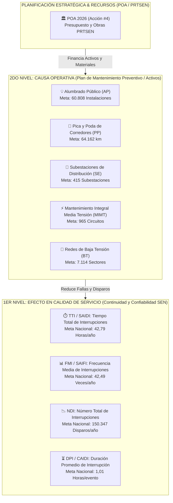

# REPÚBLICA BOLIVARIANA DE VENEZUELA
# MINISTERIO DEL PODER POPULAR PARA LA ENERGÍA ELÉCTRICA (MPPEE)
# CORPORACIÓN ELÉCTRICA NACIONAL (CORPOELEC)
# GERENCIA GENERAL DE PLANIFICACIÓN DE DISTRIBUCIÓN (GGPD)

---

```text
====================================================================================================
CÓDIGO DOCUMENTAL : DOC-GGPD-2026-METAS-001
TÍTULO            : ANÁLISIS ESTRATÉGICO Y MARCO LÓGICO DE METAS 2026 DE 1ER Y 2DO NIVEL
MARCO NORMATIVO   : ISO 8000-110 · ISO 55000/55001 · ISO 27001:2022 · ISACA COBIT 2019 · IEC 81346
ESTATUS           : OFICIAL / APROBADO PARA ALINEACIÓN DE ARQUITECTURA DE SOFTWARE
FECHA DE EMISIÓN  : 2026-08-25
AUTORES / EMISOR  : EQUIPO DE AUTOMATIZACIÓN E INGENIERÍA DE PRODUCTOS CON IA (GGPD)
DESTINATARIO      : REPOSITORIO MAESTRO DE APLICACIONES CORPOELEC
====================================================================================================
```

---

## 📑 1. Resumen Ejecutivo y Objeto del Documento

El presente documento establece el marco conceptual, matemático y de gobernanza de datos que rige el **Sistema de Medición de Metas 2026 para el Área de Distribución** de CORPOELEC, fundamentado en la documentación oficial emitida por la Gerencia General de Planificación de Distribución (GGPD) mediante la serie de memorandos `GGP-M-001-2026-01` al `GGP-M-024-2026-01` y el consolidado maestro `METAS 2026 1ER Y 2DO NIVEL.xlsx`.

Este análisis resuelve de manera definitiva la dispersión operativa histórica y define el alineamiento funcional exacto de los seis módulos de software que componen el **Repositorio Maestro de Distribución (SIGI, SCTIS, SCMTP, SCEIN, SCPPE y SCGCC)**.

---

## 🏛️ 2. Arquitectura de Medición: Relación Causal (1er y 2do Nivel)

El modelo de gestión de CORPOELEC opera bajo una estricta relación bidireccional de **Causa Operativa $\leftrightarrow$ Efecto en la Red**:



---

## 📊 3. Especificación Técnica de los Indicadores

### 3.1. Indicadores de Primer Nivel (Calidad de Servicio y Continuidad del SEN)
Representan el **resultado final percibido por los usuarios y la estabilidad del SEN**. Se miden mensualmente en los 24 estados y a escala nacional:

| Indicador | Nombre Oficial / Estándar IEEE | Unidad | Meta Anual Nacional 2026 | Propósito Estratégico |
| :--- | :--- | :---: | :---: | :--- |
| **TTI** | Tiempo Total de Interrupciones (SAIDI) | Horas | **42,79** | Mide el tiempo total acumulado que los usuarios permanecieron sin servicio. |
| **FMI** | Frecuencia Media de Interrupciones (SAIFI) | Veces | **42,49** | Mide la cantidad promedio de veces que un usuario experimentó corte de servicio. |
| **NDI** | Número de Interrupciones | Disparos | **150.347** | Volumen total de eventos de interrupción (automáticos y manuales) en media tensión. |
| **DPI** | Duración Promedio de Interrupciones (CAIDI) | Horas | **1,01** | Eficiencia de respuesta de las cuadrillas: $\text{DPI} = \frac{\text{TTI}}{\text{FMI}}$. |

---

### 3.2. Indicadores de Segundo Nivel (Plan Operativo de Mantenimiento Preventivo)
Representan la **ejecución física de mantenimiento programado** en el parque eléctrico para erradicar las causas de falla:

| Indicador | Nombre Oficial | Unidad | Meta Nacional 2026 | Criterio de Selección y Fórmula Base |
| :--- | :--- | :---: | :---: | :--- |
| **AP** | Mantenimiento de Alumbrado Público | Puntos | **60.808** | **5% semestral** sobre el parque nacional caracterizado (**2.432.312 puntos**). |
| **PP** | Pica y Poda en Corredores de Líneas | Kilómetros (km) | **64.162** | Circuitos con historial de disparos por causa *Vegetación / Condiciones Atmosféricas*. |
| **SE** | Mantenimiento de Subestaciones | Instalaciones | **415** | Mantenimiento electromecánico integral a subestaciones de distribución prioritarias. |
| **MIMT / MT**| Mantenimiento Integral de Media Tensión | Circuitos | **965** | Circuitos de alto impacto ponderado por la fórmula oficial de criticidad. |
| **BT** | Mantenimiento de Redes de Baja Tensión | Sectores | **7.114** | Sectores asociados a **Transformadores Fallados / Quemados durante el ejercicio 2025**. |

---

## 🧮 4. Fórmulas Matemáticas y Reglas de Negocio Oficiales

Extraídas de las directrices de la Gerencia Nacional de Gestión de Planificación (Memorando `GGP-M-XXX`):

### 4.1. Fórmula de Criticidad e Impacto para Selección de Circuitos (MIMT)
Para determinar cuáles circuitos deben intervenirse prioritariamente en cada estado:

$$\text{Impacto del Circuito} = (0.60 \times \text{NDI}) + (0.40 \times \text{TTI})$$

* **Criterio de Pareto (60%):** Se ordenan los circuitos de mayor a menor impacto acumulado, seleccionando aquellos que explican el **60% del impacto total** en el estado.
* **Cota Mínima Obligatoria:** En ningún caso la meta estadal puede ser inferior al **10% del total de circuitos** operativos de la entidad federal.
* **Filtro de Restricciones Operativas:** Se consideran prioritarios aquellos circuitos con restricciones registradas en la cartera PRTSEN y levantamientos técnicos de campo.

### 4.2. Regla de Mantenimiento de Redes de Baja Tensión (BT)
* La base de cálculo se construye a partir de los **transformadores dañados durante el año anterior (2025)**.
* **Regla Preventiva:** Cada estado debe incluir obligatoriamente dentro del plan los sectores afectados por cada transformador fallado, corrigiendo el balance de cargas y sobrecargas para evitar la recurrencia del daño.

---

## 🗺️ 5. Matriz de Mapeo de Software en el Repositorio Maestro

El siguiente esquema articula la responsabilidad operativa y el flujo de datos de cada aplicación refactorizada:

```text
┌──────────────────────────────────────────────────────────────────────────────────────────────────┐
│                                   SIGI (CONSOLA CENTRAL - PUERTO 3001)                           │
│     Consolidador Ejecutivo Nacional: Compara Meta Programada vs. Ejecución Real (1er y 2do Nivel) │
└──────────────────────────┬────────────────────────────────────────────┬──────────────────────────┘
                           │                                            │
         ┌─────────────────┴─────────────────┐        ┌─────────────────┴─────────────────┐
         │                                   │        │                                   │
         ▼                                   ▼        ▼                                   ▼
┌──────────────────┐               ┌──────────────────┐┌──────────────────┐     ┌──────────────────┐
│   SCTIS v2.0     │               │   SCMTP / SGTA   ││     SCEIN        │     │   SCPPE / SAMC   │
│  (PUERTO 3002)   │               │  (PUERTO 3003)   ││  (PUERTO 3005)   │     │  (PUERTO 3004)   │
├──────────────────┤               ├──────────────────┤├──────────────────┤     ├──────────────────┤
│ 1ER NIVEL:       │               │ 2DO NIVEL:       ││ 2DO NIVEL:       │     │ ESTRATÉGICO:     │
│ • Tiras de Fallas│               │ • Pica y Poda(km)││ • 415 Subestac.  │     │ • 821 PRTSEN     │
│ • TTI / FMI / NDI│               │ • Circuitos MIMT ││ • Transformadores│     │ • POA 2026 (AE#4)│
│ • Causa Raíz     │               │ • Sectores BT    ││ • Interruptores  │     │ • Cronograma $   │
└──────────────────┘               └──────────────────┘└──────────────────┘     └──────────────────┘
         ▲                                                                                ▲
         │                                                                                │
         └─────────────────────────────────┬──────────────────────────────────────────────┘
                                           │
                                ┌──────────┴──────────┐
                                │     SCGCC v1.0      │
                                │   (PUERTO 3006)     │
                                ├─────────────────────┤
                                │ TRAZABILIDAD:       │
                                │ • Memos GGP-M-001/24│
                                │ • Oficios y Minutas │
                                └─────────────────────┘
```

---

## 🔍 6. Diagnóstico: Causa de la Dispersión Histórica de Instrumentos

1. **Silos Departamentales:**
   * Las áreas de Despacho (Operaciones), Mantenimiento de Líneas, Subestaciones y Planificación operaban con sistemas y hojas de cálculo no integrados.
2. **Confusión entre Causa y Efecto:**
   * Se diseñaban instrumentos masivos intentando registrar eventos de calidad (1er nivel) y tareas físicas (2do nivel) en un mismo formulario, sobrecargando al personal de campo.
3. **Pérdida de Trazabilidad:**
   * La emisión de memorandos en papel/PDF obligaba a cada estado a responder mediante archivos dispersos, sin una base de datos centralizada como InsForge PostgreSQL.

---

## 📌 7. Hoja de Ruta para Integración en el Repositorio Maestro

1. **SCPPE-REF (Completado):**
   * Cartera de 821 proyectos vinculada a la Acción #4 del POA 2026.
   * Ficha Técnica Oficial con cronograma plurianual de inversión (2025–2031).
2. **SIGI-REF (Próxima Fase):**
   * Incorporar el **Tablero Ejecutivo de Metas 2026 (1er y 2do Nivel)** para contrastar mensualmente la cuota del memorando contra la data consolidada de SCTIS, SCMTP y SCEIN.
3. **SCGCC-REF (Próxima Fase):**
   * Catalogar los 24 Memorandos Oficiales (`GGP-M-001-2026-01` a `GGP-M-024-2026-01`) como documentos base de gestión en el módulo de correspondencia corporativa.

---

```text
====================================================================================================
CERTIFICACIÓN INDUSTRIAL SEN · ISO 8000-110 · ISO 55000 · ISO 27001:2022 · ISACA COBIT 2019
GERENCIA GENERAL DE PLANIFICACIÓN DE DISTRIBUCIÓN (GGPD) — CORPOELEC 2026
====================================================================================================
```
