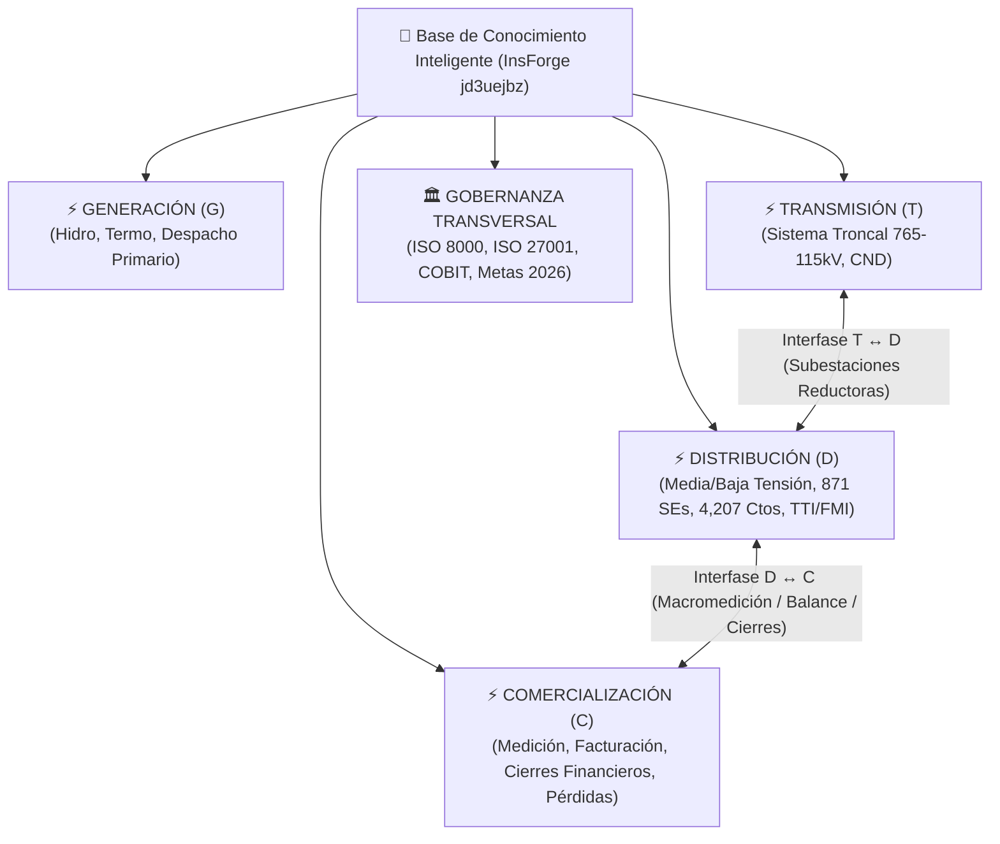

# 🧠 GGPD-BCI — Base de Conocimientos Inteligente & Memoria de IA
### Repositorio Maestro de Distribución — CORPOELEC (GGPD)

> **Alias Oficial de Conexión:** `insforge-base-conocimientos-automatizacion`  
> **Host BaaS:** `jd3uejbz.ap-southeast.database.insforge.app` (Puerto `5432` / SSL Obligatorio)  
> **Propósito:** Memoria persistente multi-agente, RAG híbrido (texto & vectorial), reducción drástica de consumo de tokens y optimización transversal de productos para CORPOELEC.

---

## 🏛️ 1. Taxonomía de los 4 Procesos Medulares del SEN

La BCI clasifica todo el conocimiento bajo una ontología canónica multi-proceso:



### Vistas Semánticas Disponibles en `public`:
- `v_knowledge_distribucion`: 519 chunks indexados.
- `v_knowledge_comercializacion`: 227 chunks indexados (normativa transversal + interfases de balance y cierres).
- `v_knowledge_transmision`: 246 chunks indexados.
- `v_knowledge_generacion`: 133 chunks indexados.
- `v_knowledge_interfases_solapadas`: 444 chunks con solapamiento inter-procesos formal.

---

## 🛡️ 2. Arquitectura de Seguridad Zero-Trust (ISO/IEC 27001)

1. **Tokens Criptográficos (`knowledge.mae_api_tokens`):**
   - Prefijo público: `bci_live_<entropy>`
   - Almacenamiento: **Exclusivamente Hashes SHA-256**.
   - Vigencia: 30, 60, 90 o 180 días con cuotas diarias por nivel de rol (`NIVEL_1`, `NIVEL_2`, `NIVEL_3`).
2. **Bitácora de Auditoría en Vivo (`knowledge.mae_auditoria_consultas`):**
   - Cumplimiento ISACA COBIT 2019 (MEA02). Registro inmutable de cada consulta, prompt, latencia y agente (`Antigravity IDE`, `Cursor`, `VS Code`, `CLI`).
3. **Consola Web de Gobernanza IAM (Módulo SIGI en VibeHost):**
   - Pestaña 8 en [Consola SIGI](https://corpoelec-sigi-corpoelec-ggpd-hosting-apps.vibehost.space) para emisión asistida, telemetría y Kill-Switch de revocación en caliente.

---

## 📁 3. Estructura del Subdirectorio `ggpd_bci/`

```text
ggpd_bci/
├── README.md                                 # Documento maestro de arquitectura y gobernanza
├── config/
│   ├── connection.json                       # Metadatos y URI de conexión InsForge
│   └── insforge_bci.env                      # Variables de entorno para agentes y servicios
├── sql/
│   ├── 01_schema_knowledge.sql               # DDL canónico de las 5 capas de memoria
│   ├── 02_security_tokens.sql                # DDL de seguridad ISO 27001, tokens y auditoría
│   └── 03_medular_processes_taxonomy.sql     # Taxonomía Multi-Proceso Medular SEN (G, T, D, C)
└── scripts/
    ├── deploy_bci.py                         # Desplegador maestro inicial
    ├── sync_knowledge.py                     # Ingestador y sincronizador continuo de Markdown a RAG
    ├── bci_admin.py                          # Herramienta CLI de administración de tokens
    └── query_bci.py                          # CLI de consulta semántica rápida
```

---

## 💻 4. Developer Kit para Desarrolladores & Servidor MCP

Para que los desarrolladores de CORPOELEC conecten sus IDEs de IA:
- **Repositorio Privado (Innovación):** `https://github.com/distribucion-corpoelec-automatizacion/corpoelec-bci-developer-kit`
- **Repositorio Privado (Personal):** `https://github.com/skidrowkodex-wq/corpoelec-bci-developer-kit`

### Uso con SDK Python:
```python
from corpoelec_bci import BCIClient

client = BCIClient()
# Consulta semántica filtrada por proceso:
chunks = client.search_rag("cierre financiero conciliación de recaudación", proceso="COMERCIALIZACION")
for c in chunks:
    print(f"[{c['documento']}] {c['titulo']} (Score: {c['score']:.4f})")
```
