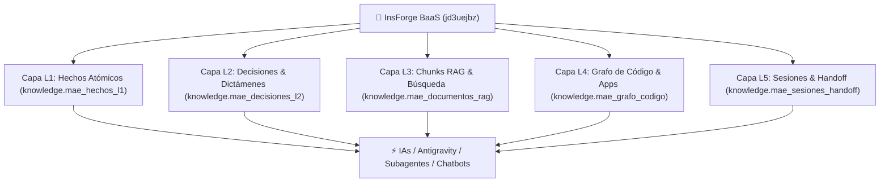

# 🧠 GGPD-BCI — Base de Conocimientos Inteligente & Memoria de IA
### Repositorio Maestro de Distribución — CORPOELEC (GGPD)

> **Alias Oficial de Conexión:** `insforge-base-conocimientos-automatizacion`  
> **Host BaaS:** `jd3uejbz.ap-southeast.database.insforge.app` (Puerto `5432` / SSL Obligatorio)  
> **Propósito:** Memoria persistente multi-agente, RAG híbrido (texto & vectorial), reducción drástica de consumo de tokens y optimización transversal de productos para CORPOELEC.

---

## 🏛️ 1. Arquitectura de 5 Capas de Memoria



1. **L1 — Hechos Atómicos (`knowledge.mae_hechos_l1`):** Puertos (`3001` a `3006`, `5000`), URLs públicas de producción en VibeHost, valores numéricos de metas SEN 2026 (`TTI`, `FMI`, `NDI`, `AP`, `PP`, `SE`, `MT`, `BT`) y perfil de hardware.
2. **L2 — Decisiones Arquitecturales (`knowledge.mae_decisiones_l2`):** ADRs y dictámenes normativos oficiales (`DOC-GGPD-2026-METAS-001`, `DOC-GGPD-2026-GOB-001`, `DOC-GGPD-2026-DIAG-PROC-001`, `DOC-GGPD-2026-BCI-001`).
3. **L3 — Documentos & Chunks RAG (`knowledge.mae_documentos_rag`):** Manuales y diagnósticos segmentados con indexación de texto completo `tsvector` en español e índice HNSW para embeddings vectoriales de 1536 dimensiones.
4. **L4 — Grafo de Código (`knowledge.mae_grafo_codigo`):** Relaciones de dependencias, esquemas de bases de datos (`core`, `sigi`, `scmtp`, `scppe`, `scein`, `sctis`, `scgcc`) y puertos de las 6 aplicaciones.
5. **L5 — Continuidad & Handoff (`knowledge.mae_sesiones_handoff`):** Historial inmutable de estados de sesión y tareas para permitir relevos perfectos entre agentes sin pérdida de contexto.

---

## 📁 2. Estructura de Archivos del Subdirectorio `ggpd_bci/`

```text
ggpd_bci/
├── README.md                      # Documento maestro de arquitectura y gobernanza
├── config/
│   ├── connection.json            # Metadatos y URI de conexión InsForge
│   └── insforge_bci.env           # Variables de entorno para agentes y servicios
├── sql/
│   └── 01_schema_knowledge.sql    # DDL canónico de tablas, triggers y vistas
├── scripts/
│   ├── deploy_bci.py              # Desplegador y sembrador maestro de las 5 capas
│   └── query_bci.py               # CLI interactivo de consulta ultra-rápida
└── examples/
    ├── agent_bci_client.py        # Módulo cliente Python reutilizable
    └── agent_bci_client.ts        # Módulo cliente TypeScript/Node.js
```

---

## 🚀 3. Uso del CLI de Consulta (`query_bci.py`)

Para consultar la base de conocimientos sin cargar archivos enteros a los modelos de lenguaje:

```bash
# Ver resumen general de la base de conocimiento
python3 ggpd_bci/scripts/query_bci.py --summary

# Buscar en la base RAG por lenguaje natural (ej. fórmula MIMT Pareto)
python3 ggpd_bci/scripts/query_bci.py --search "Pareto"

# Consultar hechos atómicos (puertos, URLs, metas)
python3 ggpd_bci/scripts/query_bci.py --facts

# Consultar decisiones arquitecturales y dictámenes normativos
python3 ggpd_bci/scripts/query_bci.py --decisions

# Consultar el grafo de dependencias de una app específica (ej. SCGCC-REF)
python3 ggpd_bci/scripts/query_bci.py --graph SCGCC-REF
```

---

## 🛡️ 4. Cumplimiento Normativo de Grado Industrial SEN

- **ISO/IEC 27001:** Segregación total entre la base de datos transaccional de producción (`ggpd-data-maestra-0002`) y la base de conocimiento de IA (`insforge-base-conocimientos-automatizacion`).
- **ISO 8000-110:** Datos sintáctica y semánticamente normalizados con clave primaria única y tipos de datos estrictos.
- **ISACA COBIT 2019 (MEA02):** Auditoría inmutable de sesiones y cambios en las capas de decisión y handoff.
- **Hardware de Cero Sobrecarga:** 0 MB de consumo de RAM en el host local (Dell Latitude 3110).
